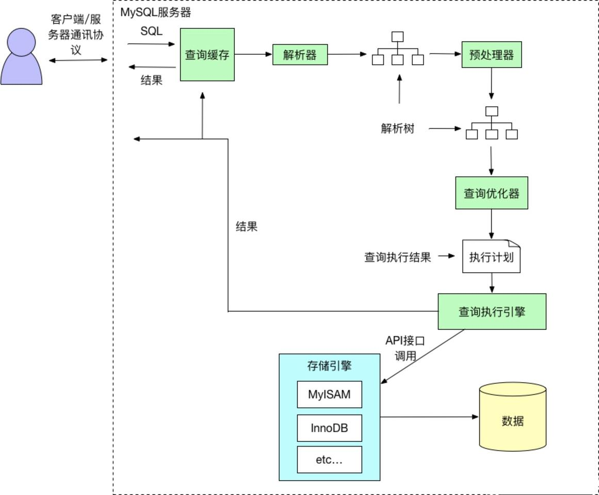
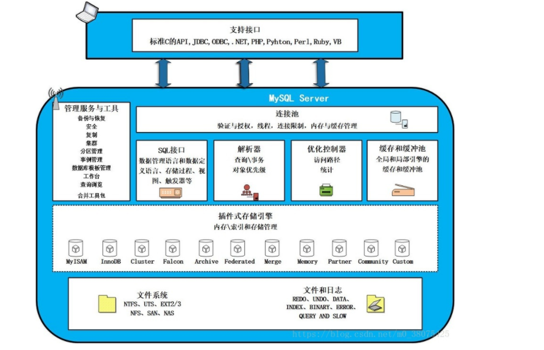

# mysql日常知识总结
mysql作为数据层 与我们的日常应用连接非常密切，在此总结了一些使用知识  

## mysql执行的大致流程

存储引擎架构分为三层，自上而下，分为第一层：连接层；第二层：服务层；第三层：引擎层。  

### 连接层：
MySQL的最上层是连接服务，引入了线程池的概念，允许多台客户端连接。主要工作是：连接处理、授权认证、安全防护等。
连接层为通过安全认证的接入用户提供线程，同样，在该层上可以实现基于SSL 的安全连接。
SHOW PROCESSLIST; //使用此命令可以查看每条连接的状态以及正在执行的命令等
SHOW STATUS LIKE '%Thread%' //此命令可以查看数据当前创建了多少线程 以及缓存池情况，如果连接断开频繁，可以适当调整缓存池

### 服务层：
服务层用于处理核心服务，如标准的SQL接口、查询解析、SQL优化和统计、全局的和引擎依赖的缓存与缓冲器等等。所有的与存储引擎无关的工作，如过程、函数等，都会在这一层来处理。在该层上，服务器会解析查询并创建相应的内部解析树，并对其完成优化，如确定查询表的顺序，是否利用索引等，最后生成相关的执行操作。如果是SELECT 语句，服务器还会查询内部的缓存。如果缓存空间足够大，这样在解决大量读操作的环境中能够很好的提升系统的性能。

### 引擎层：
存储引擎层，存储引擎负责实际的MySQL数据的存储与提取，服务器通过API 与 存储引擎进行通信。不同的存储引擎功能和特性有所不同，这样可以根据实际需要有针对性的使用不同的存储引擎。

## sql语句执行顺序 语句中的序号为该查询语句的处理顺序

(8)SELECT 
(9)DISTINCT <select_list>
(1)FROM <left_table>
(3)<join_type>JOIN <right_table>
(2)ON<join_condition>
(4)WHERE<where_condition>
(5)GROUP BY<group_by_list>
(6)WITH {CUBE|ROLLUP}
(7)HAVING<having_condition>
(10)ORDER BY<order_by_list>
(11)LIMIT<limit_number>

1.FROM：对FROM子句中的左表<left_table>和右表<right_table>执行笛卡儿积，产生虚拟表VT1
2.ON：对虚拟表VT1应用ON筛选，只有那些符合<join_condition>的行才被插入虚拟表VT2中
3.3.JOIN：如果指定了OUTER JOIN（如LEFT OUTER JOIN、RIGHT OUTER JOIN），那么保留表中未匹配的行作为外部行添加到虚拟表VT2中，产生虚拟表VT3。如果FROM子句包含两个以上表，则对上一个连接生成的结果表VT3和下一个表重复执行步骤1）～步骤3），直到处理完所有的表为止
4.WHERE：对虚拟表VT3应用WHERE过滤条件，只有符合<where_condition>的记录才被插入虚拟表VT4中
5.GROUP BY：根据GROUP BY子句中的列，对VT4中的记录进行分组操作，产生VT5
6.CUBE|ROLLUP：对表VT5进行CUBE或ROLLUP操作，产生表VT6
7.HAVING：对虚拟表VT6应用HAVING过滤器，只有符合<having_condition>的记录才被插入虚拟表VT7中。
8.SELECT：第二次执行SELECT操作，选择指定的列，插入到虚拟表VT8中
9.DISTINCT：去除重复数据，产生虚拟表VT9
10.ORDER BY：将虚拟表VT9中的记录按照<order_by_list>进行排序操作，产生虚拟表VT10
11.LIMIT：取出指定行的记录，产生虚拟表VT11，并返回给查询用户

## mysql查询语句的执行计划
explain 显示了mysql如何使用索引来处理select 语句以及连接表，可以帮助更好的建立索引和写出更优的查询语句
| id | select_type | table | type | possible_keys | key | key_len | ref | rows | Extra 

id: SELECT 查询的标识符. 每个 SELECT 都会自动分配一个唯一的标识符.

select_type: SELECT 查询的类型.
(1) SIMPLE(简单SELECT,不使用UNION或子查询等)
(2) PRIMARY(查询中若包含任何复杂的子部分,最外层的select被标记为PRIMARY)
(3) UNION(UNION中的第二个或后面的SELECT语句)
(4) DEPENDENT UNION(UNION中的第二个或后面的SELECT语句，取决于外面的查询)
(5) UNION RESULT(UNION的结果)
(6) SUBQUERY(子查询中的第一个SELECT)
(7) DEPENDENT SUBQUERY(子查询中的第一个SELECT，取决于外面的查询)
(8) DERIVED(派生表的SELECT, FROM子句的子查询)
(9) UNCACHEABLE SUBQUERY(一个子查询的结果不能被缓存，必须重新评估外链接的第一行)

table: 查询的是哪个表

type:表示MySQL在表中找到所需行的方式，又称“访问类型”(重要指标，最好能在range以上)

ALL：Full Table Scan， MySQL将遍历全表以找到匹配的行
index: Full Index Scan，index与ALL区别为index类型只遍历索引树，例如只查询索引中的某个字段
range:只检索给定范围的行，使用一个索引来选择行
ref: 表示上述表的连接匹配条件，即哪些列或常量被用于查找索引列上的值
eq_ref: 类似ref，区别就在使用的索引是唯一索引，对于每个索引键值，表中只有一条记录匹配，简单来说，就是多表连接中使用primary key或者 unique key作为关联条件
const、system: 当MySQL对查询某部分进行优化，并转换为一个常量时，使用这些类型访问。如将主键置于where列表中，MySQL就能将该查询转换为一个常量,system是const类型的特例，当查询的表只有一行的情况下，使用system

possible_keys: 此次查询中可能选用的索引

key: 此次查询中确切使用到的索引.

ref: 哪个字段或常数与 key 一起被使用

rows: 显示此查询一共扫描了多少行. 这个是一个估计值.

filtered: 表示此查询条件所过滤的数据的百分比

extra: 额外的信息

## 防sql注入
1.什么是sql注入
就是我们在拼接sql的时候，没有过滤用户的非法sql，导致查询结果和我们预想的不一样。
举个简单例子来帮助理解
比如我们要根据用户名和密码进行登录，我们后台sql这样写
SELECT * FROM user WHERE username = ? and password = ?
我们预想的：用户输入 username：张三，password：123456
但实际人家这样输入： username：张三，password： " or 1 = 1 –
我们的sql将变成这样了
SELECT * FROM user WHERE username = "张三" and password = "" or 1 = 1 -- "
后面这个 – 就是注释，它注释了后面的其它内容，整个sql就变成下面这样，因为 or 1 = 1，所以怎么都会出结果
SELECT * FROM user WHERE username = "张三" and password = "" or 1 = 1

2.怎么防止sql注入，
通过上面的解释我们知道sql注入，是通过字符串动态sql拼接的
1.不要信任用户的输入。对用户的输入进行校验，可以通过正则表达式，或限制长度；对单引号和 双"-"进行转换等。
2.不要使用动态拼装sql，可以使用预编译l或者直接使用存储过程进行数据查询存取。
3.不要使用管理员权限的数据库连接，为每个应用使用单独的权限有限的数据库连接。
4.不要把机密信息直接存放，加密或者hash掉密码和敏感的信息。
5.应用的异常信息应该给出尽可能少的提示，最好使用自定义的错误信息对原始错误信息进行包装

上面说了一大串 其实最简单的就是使用预编译来防止注入
为什么使预编译可以防止注入呢

在使用PreparedStatement执行SQL命令时，命令会带着占位符被数据库进行编译和解析，并放到命令缓冲区。然后，每当执行同一个PreparedStatement语句的时候，由于在缓冲区中可以发现预编译的命令，就不会被再次编译。而SQL注入只对编译过程有破坏作用，执行阶段只是把输入串作为数据处理，不需要再对SQL语句进行解析，因此解决了注入问题。因为SQL语句编译阶段是进行词法分析、语法分析、语义分析等过程的，也就是说编译过程识别了关键字、执行逻辑之类的东西，编译结束了这条SQL语句能干什么就定了。而在编译之后加入注入的部分，就已经没办法改变执行逻辑了，这部分就只能是相当于输入字符串被处
也就是说 预编译后 
SELECT * FROM user WHERE username = "张三" and password = "" or 1 = 1 -- " 
并不会变为
SELECT * FROM user WHERE username = "张三" and password = "" or 1 = 1
而是会比较 password是否等于  "" or 1 = 1

## mysql事务
#### 什么是事务 
简单来说 事务就是一组操作的统一执行并保证结果状态的一致性
#### 为什么需要事务：
拿转账举例：A 转 1000 给 B ，正常应该是 A-1000 B+1000  ，但如果A成功扣除 B添加失败呢，如果没有事务 那A就白白损失1000了 如果有事务则能保证回滚到扣除之前的状态

#### 事务的特性：

Atomicity（原子性）：一个事务必须被视为一个不可分割的最小工作单元，整个事务中的所有操作要么全部提交成功，要么全部失败回滚，对于一个事务来说，不可能只执行其中的一部分操作。
Consistency（一致性）：数据库总是从一个一致性状态转换到另一个一致状态。
Isolation（隔离性）：通常来说，一个事务所做的修改在最终提交以前，对其他事务是不可见的。注意这里的“通常来说”，后面的事务隔离级级别会说到。
Durability（持久性）：一旦事务提交，则其所做的修改就会永久保存到数据库中。此时即使系统崩溃，修改的数据也不会丢失。（持久性的安全性与刷新日志级别也存在一定关系，不同的级别对应不同的数据安全级别。）

#### 事务的实现：
1. 原子性：undo log保证  ，当在事务中遇到错误无法执行时 可以通过undo log 实现回滚，保证原子性
	undo log有两个作用：提供回滚和多个行版本控制(MVCC)
在数据修改的时候，不仅记录了redo，还记录了相对应的undo，如果因为某些原因导致事务失败或回滚了，可以借助该undo进行回滚。
undo log和redo log记录物理日志不一样，它是逻辑日志。可以认为当delete一条记录时，undo log中会记录一条对应的insert记录，反之亦然，当update一条记录时，它记录一条对应相反的update记录。
当执行rollback时，就可以从undo log中的逻辑记录读取到相应的内容并进行回滚。有时候应用到行版本控制的时候，也是通过undo log来实现的：当读取的某一行被其他事务锁定时，它可以从undo log中分析出该行记录以前的数据是什么，从而提供该行版本信息，让用户实现非锁定一致性读取。
undo log是采用段(segment)的方式来记录的，每个undo操作在记录的时候占用一个undo log segment。
另外，undo log也会产生redo log，因为undo log也要实现持久性保护

2. 一致性：最终想要的结果  由原子性 隔离性 持久性来保证

3. 持久性：redo log
当缓冲池中的页的版本比磁盘要新时，数据库需要将新版本的页从缓冲池刷新到磁盘。但是如果
每次一个页发送变化，就进行刷新，那么性能开发是非常大的，于是InnoDB采用了Write Ahead
Log（WAL）策略和Force Log at Commit机制实现事务级别下数据的持久性。
WAL要求数据的变更写入到磁盘前，首先必须将内存中的日志写入到磁盘；
Force-log-at-commit要求当一个事务提交时，所有产生的日志都必须刷新到磁盘上，如果日志刷
新成功后，缓冲池中的数据刷新到磁盘前数据库发生了宕机，那么重启时，数据库可以从日志中 恢复数据。
为了确保每次日志都写入到重做日志文件，在每次将重做日志缓冲写入重做日志后，必须调用一
次fsync操作，将缓冲文件从文件系统缓存中真正写入磁盘。 可以通过 innodb_flush_log_at_trx_commit
来控制重做日志刷新到磁盘的策略。
InnoDB的innodb_flush_log_at_trx_commit属性可以控制每次事务提交时InnoDB的行为。
当属性值为0时，事务提交时，不会对重做日志进行写入操作，而是等待主线程按时写入；
当属性值为1时，事务提交时，会将重做日志写入文件系统缓存，并且调用文件系统的fsync，将文
件系统缓冲中的数据真正写入磁盘存储，确保不会出现数据丢失；
当属性值为2时，事务提交时，也会将日志文件写入文件系统缓存，但是不会调用fsync，而是让文
件系统自己去判断何时将缓存写入磁盘。
innodb_flush_log_at_commit是InnoDB性能调优的一个基础参数，涉及InnoDB的写入效率和数
据安全。当参数值为0时，写入效率最高，但是数据安全最低；参数值为1时，写入效率最低，但
是数据安全最高；参数值为2时，二者都是中等水平。一般建议将该属性值设置为1，以获得较高
的数据安全性，而且也只有设置为1，才能保证事务的持久性。
redo log包括两部分：一是内存中的日志缓冲(redo log buffer)，该部分日志是易失性的；二是磁盘上的重做日志文件(redo log file)，该部分日志是持久的。
为了确保每次日志都能写入到事务日志文件中，在每次将log buffer中的日志写入日志文件的过程中都会调用一次操作系统的fsync操作(即fsync()系统调用)

4. 事务的隔离性
事务的隔离性是通过锁、MVCC等实现  不同的隔离级别 有不同的效果

### 事务的隔离级别

第1级别：Read Uncommitted(读取未提交内容)
所有事务都可以看到其他未提交事务的执行结果
本隔离级别很少用于实际应用，因为它的性能也不比其他级别好多少
该级别引发的问题是——脏读(Dirty Read)：读取到了未提交的数据

第2级别：Read Committed(读取提交内容)
这是大多数数据库系统的默认隔离级别（但不是MySQL默认的）
它满足了隔离的简单定义：一个事务只能看见已经提交事务所做的改变
这种隔离级别出现的问题是——不可重复读(Nonrepeatable Read)：不可重复读意味着我们在同一个事务中执行完全相同的select语句时可能看到不一样的结果。导致这种情况的原因可能有：
有一个交叉的事务有新的commit，导致了数据的改变;
一个数据库被多个实例操作时,同一事务的其他实例在该实例处理其间可能会有新的commit

第3级别：Repeatable Read(可重读)
这是MySQL的默认事务隔离级别
它确保同一事务的多个实例在并发读取数据时，会看到同样的数据行
此级别可能出现的问题——幻读(Phantom Read)：当用户读取某一范围的数据行时，另一个事务又在该范围内插入了新行，当用户再读取该范围的数据行时，会发现有新的“幻影” 行
InnoDB存储引擎通过多版本并发控制(MVCC，Multiversion Concurrency Control)机制解决幻读问题；InnoDB还通过间隙锁解决幻读问题

第4级别：Serializable(可串行化)
这是最高的隔离级别
它通过强制事务排序，使之不可能相互冲突，从而解决幻读问题。简言之,它是在每个读的数据行上加上共享锁。

### MVCC：
全称Multi-Version Concurrency Control，即多版本并发控制，主要是为了提高数据库的并发性能。
同一行数据平时发生读写请求时，会上锁阻塞住。但mvcc用更好的方式去处理读—写请求，做到在发生读—写请求冲突时不用加锁（这里的读指的是快照读，当前读还是得加锁）

什么是MySQL InnoDB下的当前读和快照读？

当前读
它读取的数据库记录，都是当前最新的版本，会对当前读取的数据进行加锁，防止其他事务修改数据。是悲观锁的一种操作。
如下操作都是当前读：
select lock in share mode (共享锁)
select for update (排他锁)
update (排他锁)
insert (排他锁)
delete (排他锁)

快照读
快照读的实现是基于多版本并发控制，即MVCC，既然是多版本，那么快照读读到的数据不一定是当前最新的数据，有可能是之前历史版本的数据。
如下操作是快照读：
不加锁的select操作

#### MVCC的实现原理
它的实现原理主要是版本链，undo日志 ，Read View 来实现的

1.版本链
我们数据库中的每行数据，除了我们肉眼看见的数据，还有几个隐藏字段，。分别是db_trx_id、db_roll_pointer、db_row_id。

db_trx_id
6byte，最近修改(修改/插入)事务ID：记录创建这条记录/最后一次修改该记录的事务ID。

db_roll_pointer（版本链关键）
7byte，回滚指针，指向这条记录的上一个版本（存储于rollback segment里）

db_row_id
6byte，隐含的自增ID（隐藏主键），如果数据表没有主键，InnoDB会自动以db_row_id产生一个聚簇索引。

db_row_id是数据库默认为该行记录生成的唯一隐式主键，db_trx_id是当前操作该记录的事务ID，而db_roll_pointer是一个回滚指针，用于配合undo日志，指向上一个旧版本。

对该记录每次更新后，都会将旧值放到一条undo日志中，就算是该记录的一个旧版本，随着更新次数的增多，所有的版本都会被roll_pointer属性连接成一个链表，我们把这个链表称之为版本链，版本链的头节点就是当前记录最新的值。另外，每个版本中还包含生成该版本时对应的事务id，这个信息很重要，在根据ReadView判断版本可见性的时候会用到

2.undo日志
Undo log 主要用于记录数据被修改之前的日志，在表信息修改之前先会把数据拷贝到undo log里。
当事务进行回滚时可以通过undo log 里的日志进行数据还原。
Undo log 的用途

保证事务进行rollback时的原子性和一致性，当事务进行回滚的时候可以用undo log的数据进行恢复。

用于MVCC快照读的数据，在MVCC多版本控制中，通过读取undo log的历史版本数据可以实现不同事务版本号都拥有自己独立的快照数据版本。

undo log主要分为两种：
insert undo log
代表事务在insert新记录时产生的undo log , 只在事务回滚时需要，并且在事务提交后可以被立即丢弃

update undo log（主要）
事务在进行update或delete时产生的undo log ; 不仅在事务回滚时需要，在快照读时也需要；
所以不能随便删除，只有在快速读或事务回滚不涉及该日志时，对应的日志才会被purge线程统一清除

3.Read View(读视图)
事务进行快照读操作的时候生产的读视图(Read View)，在该事务执行的快照读的那一刻，会生成数据库系统当前的一个快照。
记录并维护系统当前活跃事务的ID(没有commit，当每个事务开启时，都会被分配一个ID, 这个ID是递增的，所以越新的事务，ID值越大)，是系统中当前不应该被本事务看到的其他事务id列表。
Read View主要是用来做可见性判断的, 即当我们某个事务执行快照读的时候，对该记录创建一个Read View读视图，把它比作条件用来判断当前事务能够看到哪个版本的数据，既可能是当前最新的数据，也有可能是该行记录的undo log里面的某个版本的数据。
Read View几个属性
trx_ids: 当前系统活跃(未提交)事务版本号集合。

low_limit_id: 创建当前read view 时“当前系统最大事务版本号+1”。

up_limit_id: 创建当前read view 时“系统正处于活跃事务最小版本号”

creator_trx_id: 创建当前read view的事务版本号；

db_trx_id < up_limit_id || db_trx_id == creator_trx_id（显示）
如果数据事务ID小于read view中的最小活跃事务ID，则可以肯定该数据是在当前事务启之前就已经存在了的,所以可以显示。
或者数据的事务ID等于creator_trx_id ，那么说明这个数据就是当前事务自己生成的，自己生成的数据自己当然能看见，所以这种情况下此数据也是可以显示的。

db_trx_id >= low_limit_id（不显示）
如果数据事务ID大于read view 中的当前系统的最大事务ID，则说明该数据是在当前read view 创建之后才产生的，所以数据不显示。如果小于则进入下一个判断

db_trx_id是否在活跃事务（trx_ids）中

不存在：则说明read view产生的时候事务已经commit了，这种情况数据则可以显示。

已存在：则代表我Read View生成时刻，你这个事务还在活跃，还没有Commit，你修改的数据，我当前事务也是看不见的。

#### MVCC和事务隔离级别
RR、RC生成时机
RC隔离级别下，是每个快照读都会生成并获取最新的Read View；
而在RR隔离级别下，则是同一个事务中的第一个快照读才会创建Read View, 之后的快照读获取的都是同一个Read View，之后的查询就不会重复生成了，所以一个事务的查询结果每次都是一样的。

举个简单的例子：
一个事务A（txnId=100）修改了数据X，使得X=1，并且commit了
另外一个事务B（txnId=101）开始尝试读取X，但是还X=1。但B没有提交。
第三个事务C（txnId=102）修改了数据X，使得X=2。并且提交了
事务B又一次读取了X。这时
如果事务B是Read Committed。那么就读取X的最新commit的版本，也就是X=2
如果事务B是Repeatable Read。那么读取的就是当前事务（txnId=101）之前X的最新版本，也就是X被txnId=100提交的版本，即X=1。

解决幻读问题
快照读：通过MVCC来进行控制的，不用加锁。

当前读：通过next-key锁（行锁+gap锁）来解决问题的。 