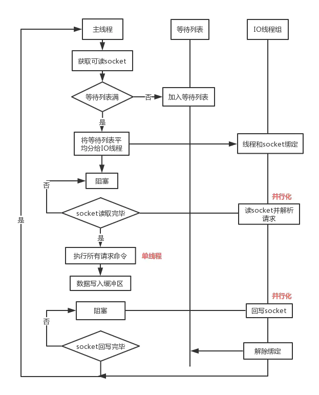
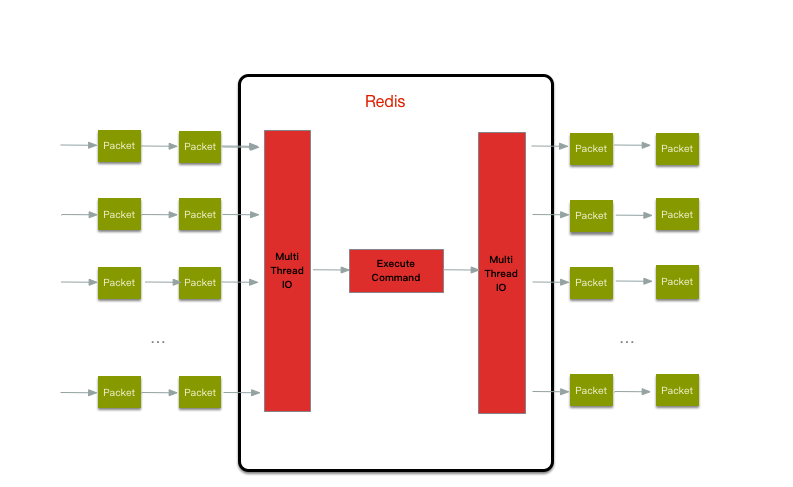

# redis6
redis6中引入了多线程，使用多线程进行读和写，在执行命令的时候还是单线程
## 多线程的实现

 

多线程处理流程
1. 主线程负责接收建立连接请求，获取socket放入全局等待队列
2. 主线程处理完读事件之后，通过RR(Round Robin)将这些连接分配给这些IO线程
3. 主线程阻塞等待IO线程读取socket完毕
4. 主线程通过单线程的方式执行请求命令，请求数据读取并解析完成，但并不回写
5. 主线程阻塞等待IO线程将数据回写socket完毕
6. 解除绑定，清空等待队列

设计的特点：
- IO线程不能同时读写
- IO线程只负责读写socket解析命令，不负责命令处理

多线程只是用来处理网络数据的读写和协议的解析，执行命令还是使用的单线程

这些读写线程在同一时刻要不全部在读要不全部在写，不会出现即在读又在写的情况

## 参考
[redis6新特性](https://www.jianshu.com/p/64fcdc85066b)