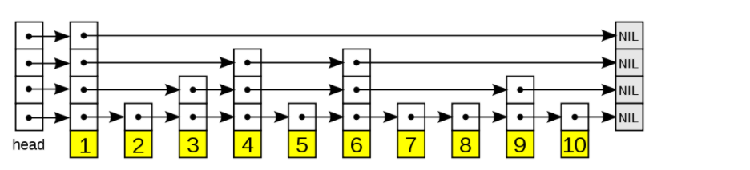

# redis中zset的两种实现方式
## ziplist编码

## skiplist编码
skip list跳表一种随机化的数据结构，基于并联的链表，增删改查的时间复杂度都是O(logN)
跳跃表的结构图：

跳跃表的组成：
- 表头(head)：负责维护跳跃表的节点指针
- 跳跃表节点：保存元素值和多个层
- 层：保存着指向其他元素的指针。高层的指针越过的元素数量大于等于低层的指针，在查找的时候先是从高层开始访问，随着元素值范围的缩小，慢慢降低层次
- 表尾：全部由NULL组成，表示结尾

跳跃表的查找和二分查找有着异曲同工之处

[跳跃表](https://redisbook.readthedocs.io/en/latest/internal-datastruct/skiplist.html#id4)
