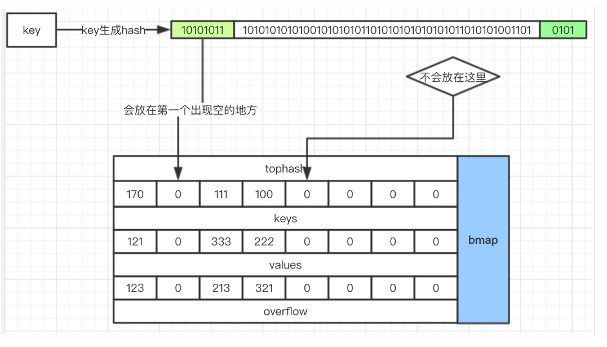

# golang源码阅读之map

## 1、map的结构
```
type hmap struct {
	count     int // 元素个数
	flags     uint8
	B         uint8  // 2^B表示buckets这个数组的大小
	noverflow uint16 // 
	hash0     uint32 // 哈希种子
	// buckets是一个bucket的数组，每一个bucket中存放的是一个bmap，其中买个bmap中可以存8个key-value
	buckets unsafe.Pointer 
	// 扩容的时候使用，表示的是老的那个buckets
	oldbuckets unsafe.Pointer 
	nevacuate  uintptr        
	// 将包含指针的信息保存起来,使得gc在扫描的时候不会去扫描整个map
	extra *mapextra // optional fields
}

```

```
type mapextra struct {
	// If both key and value do not contain pointers and are inline, then we mark bucket type as containing no pointers.
	// 如果这个key和value是不包含指针或者内联的,我们标记这个桶是不包含指针的
	// This avoids scanning such maps.
	// 避免扫描每一个桶
	// However, bmap.overflow is a pointer. In order to keep overflow buckets alive,
	// we store pointers to all overflow buckets in hmap.extra.overflow and hmap.extra.oldoverflow.
	// overflow and oldoverflow are only used if key and value do not contain pointers.
	// overflow contains overflow buckets for hmap.buckets.
	// oldoverflow contains overflow buckets for hmap.oldbuckets.
	// The indirection allows to store a pointer to the slice in hiter.
	overflow    *[]*bmap // 指向的是后面的溢出桶
	oldoverflow *[]*bmap // 扩容的时候使用

	// nextOverflow holds a pointer to a free overflow bucket.
	// 指向空闲的 overflow bucket的指针
	nextOverflow *bmap
}
type bmap struct {
	// tophash generally contains the top byte of the hash value for each key in this bucket.
	// If tophash[0] < minTopHash, tophash[0] is a bucket evacuation state instead.
	// 这个就限定了一个桶可容纳的键值对的数量
	tophash [bucketCnt]uint8
	// 实际中每一个bmap中都会有一个overflow指向下一个bmap
	// Followed by bucketCnt keys and then bucketCnt values.
	// NOTE: packing all the keys together and then all the values together makes the code a bit more complicated than alternating key/value/key/value/...
	// but it allows us to eliminate padding which would be needed for, e.g., map[int64]int8.
	// Followed by an overflow pointer.
}

```


结构中 
	1. buckets是一个数组， 每一个后面会有一个bmap的链表，其中每一个bmap中最对只能保存
	2. oldbuckets 只是在扩容的时候使用
	3. extra表示的是在key和value中不包含指针的情况下，并行元素小于128k的时候进行内联，这个时候为了避免gc扫描整个hmap就是使用extra
	4. mapextra这个内部的overflow和oldoverflow还是存放的bmap
注意golang中的map在扩容的过程中，还是一个链表，是以buckets的形式进行扩容的

## 2、创建一个map
就是初始化一个map
```
func makemap(t *maptype, hint int, h *hmap) *hmap {
	if hint < 0 || hint > int(maxSliceCap(t.bucket.size)) {
		hint = 0
	}

	// initialize Hmap
	if h == nil {
		h = new(hmap)
	}
	h.hash0 = fastrand()

	// find size parameter which will hold the requested # of elements
	B := uint8(0)
	// 确定初始化的时候buckets的大小
	for overLoadFactor(hint, B) {
		B++
	}
	h.B = B
	// allocate initial hash table
	// if B == 0, the buckets field is allocated lazily later (in mapassign)
	// If hint is large zeroing this memory could take a while.
	if h.B != 0 {
		var nextOverflow *bmap
		// 给buckets分配内存
		h.buckets, nextOverflow = makeBucketArray(t, h.B, nil)
		if nextOverflow != nil {
			h.extra = new(mapextra)
			h.extra.nextOverflow = nextOverflow
		}
	}

	return h
}

```


## 3、map中的操作
### 3.1、Get操作
从map中获取一个元素，需要对key进行去hash然后在去找到那个元素，因此go中也是类似的

从图中可以看到，
1. 根据hash值的前8位定位桶中的格子
2. hash的后B位是定位在那个bucket中
3. 使用整个hash值判断key是否存在
4. 如果bmap中没有机会去overflow指向的下一个去查找，直到找到或者没有找到
注意tophash的作用就是快速的比较，当前面的几位都不匹配是就可以快速的去后面查找了
代码：
```

```
### 3.2、Put操作
put操作基本就是get操作的逆操作
1. 对key计算出相应的hash值
2. 通过后八位找到bmap
3. 通过前八位找到key是否存在，如果不存在判断bmap中是否有空位，如果没有就进行溢出桶，使用overflow指向，将key和value放到新的bmap中，在放置key的时候是放在第一个出现空位的地方

bmap中的空格是由于删除操作造成的
代码：
```
func mapassign(mapType *maptype, h *hmap, key unsafe.Pointer) unsafe.Pointer {
	...
	if h.flags&hashWriting != 0 {
		throw("concurrent map writes")
	}
	alg := mapType.key.alg
	// 获取key的hash值
	hash := alg.hash(key, uintptr(h.hash0))

	// Set hashWriting after calling alg.hash, since alg.hash may panic,
	// in which case we have not actually done a write.
	// 设置标志位，表示当前的map正在写，不是并发安全的存在的意义在哪里
	h.flags |= hashWriting
	// 当buckets为nil是重新分配
	if h.buckets == nil {
		h.buckets = newobject(mapType.bucket) // newarray(mapType.bucket, 1)
	}

again:
	bucket := hash & bucketMask(h.B) // 取到key所对应的桶的位置
	if h.growing() {                 // 判断map是否正在增长
		growWork(mapType, h, bucket)
	}
	// b表示的是这个key应该存的那个bmap
	currentBMap := (*bmap)(unsafe.Pointer(uintptr(h.buckets) + bucket*uintptr(mapType.bucketsize)))
	// 获取hash的前八位
	top := tophash(hash)

	var inserti *uint8         // 用于保存tophash中的值，即桶中的格子
	var insertk unsafe.Pointer // 可以放key
	var val unsafe.Pointer	   // 可以放value
	for {
		for i := uintptr(0); i < bucketCnt; i++ {
			if currentBMap.tophash[i] != top {
				//Todo：这个判断是用来做什么？
				if currentBMap.tophash[i] == empty && inserti == nil {
					inserti = &currentBMap.tophash[i]
					insertk = add(unsafe.Pointer(currentBMap), dataOffset+i*uintptr(mapType.keysize))
					val = add(unsafe.Pointer(currentBMap), dataOffset+bucketCnt*uintptr(mapType.keysize)+i*uintptr(mapType.valuesize))
				}
				continue
			}
			k := add(unsafe.Pointer(currentBMap), dataOffset+i*uintptr(mapType.keysize))
			if mapType.indirectkey {
				k = *((*unsafe.Pointer)(k))
			}
			if !alg.equal(key, k) {
				continue
			}
			// already have a mapping for key. Update it.
			// 对应的key中有值时就更新这个值
			if mapType.needkeyupdate {
				typedmemmove(mapType.key, k, key)
			}
			val = add(unsafe.Pointer(currentBMap), dataOffset+bucketCnt*uintptr(mapType.keysize)+i*uintptr(mapType.valuesize))
			goto done
		}
		// 当前的bmap中如果没有了溢出桶时就跳出循环，则表示在bmap中没有空位
		ovf := currentBMap.overflow(mapType)
		if ovf == nil {
			break
		}
		currentBMap = ovf
	}

	// Did not find mapping for key. Allocate new cell & add entry.

	// If we hit the max load factor or we have too many overflow buckets,
	// and we're not already in the middle of growing, start growing.
	// 判断当前的map没有扩容过并且负载因子过大或者有太多的的溢出桶，进行map增长
	if !h.growing() && (overLoadFactor(h.count+1, h.B) || tooManyOverflowBuckets(h.noverflow, h.B)) {
		hashGrow(mapType, h)
		// map增长后再次尝试存放key和value
		goto again // Growing the table invalidates everything, so try again
	}
	//表示所有的
	if inserti == nil {
		// all current buckets are full, allocate a new one.
		newb := h.newoverflow(mapType, currentBMap)
		inserti = &newb.tophash[0]
		insertk = add(unsafe.Pointer(newb), dataOffset)
		val = add(insertk, bucketCnt*uintptr(mapType.keysize))
	}

	// store new key/value at insert position
	if mapType.indirectkey {
		kmem := newobject(mapType.key)
		*(*unsafe.Pointer)(insertk) = kmem
		insertk = kmem
	}
	if mapType.indirectvalue {
		vmem := newobject(mapType.elem)
		*(*unsafe.Pointer)(val) = vmem
	}
	typedmemmove(mapType.key, insertk, key)
	*inserti = top
	h.count++

done:
	if h.flags&hashWriting == 0 {
		throw("concurrent map writes")
	}
	h.flags &^= hashWriting
	if mapType.indirectvalue {
		val = *((*unsafe.Pointer)(val))
	}
	return val
}
```


### 3.3、Delete操作


