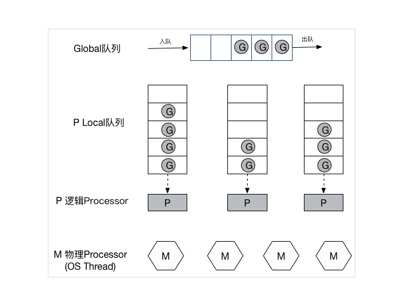

go中的常用知识点
### 1、go中如何安全的访问共享变量
	- 互斥锁
	- channel用于goroutine之间，这个也符合go的使用通信去共享，而不是通过共享而通信
	
### 2、无缓冲的chan接收和发送是否同步
	- 无缓冲的接收和发送是要同步的，不然会出现阻塞
	- 有缓冲的，当缓冲没有满的时候发送不会阻塞，当缓冲有内容时接收不会阻塞

### 3、go语言的并发机制和使用CSP并发模型
CSP并发模型：以通信的方式进行共享内存，而非传统的以共享内存进行通信。用来描述两个独立的并发实体之间通过共享的管道进行通信的并发模型
golang中channel是被单独创建出来的可以再并发实体之间传递信息，用于两个匿名的实体之间。channel类似于一个消息队列，并发实体之间通过给channel中产生消息和消费消息实现了解耦
goroutine是go中实际执行并发的实体，它的底层是通过协程实现并发，coroutine是运行再用户态的用户线程，go底层选择coroutine的出发点，它具备的特点：
- 用户空间，避免了内核态和用户态之间的切换导致的成本
- 可以由语言和框架层进行调度
- 更小的栈空间允许创建更多的实例
goroutine的特性：
go内部的三个对象： P(processer)代表上下文，也可以理解为cpu，M工作线程， G表示对象(gotoutine)
G：代表goroutine
M(Machine)：对内核线程的封装，对应真实的CPU数，真正干活的
P(Processer): G和M的中间调度，数量可以由GOMAXPROCS()来设置，默认为核心数


### 4、go中常用的并发模型
#### 使用Channel实现的并发模型


#### 使用sync的WaitGroup实现的并发模型
需要注意的是避免出现死锁
如：
```
func main(){
	wg := sync.WaitGroup{}
	for i := 0; i < 1; i++{
		wg.Add(1)
		go func(wg sync.WaitGroup, i int) {
			fmt.Println(i)
			wg.Done()
		}(wg, i)
	}
	wg.Wait()
}
```
[演示](https://play.golang.org/p/RY_1ChRH7zs)
会出现死锁的现象，因为传入的wg只是拷贝的副本， 使用指针传递就不会出现了，还可以不传人，由于go中支持闭包类型，因此在里面可以直接使用外面的变量

#### 使用context实现并发控制
[go context深入理解](https://juejin.im/post/5a6873fef265da3e317e55b6)

### 5、json标准库对nil slice和空slice的处理一致吗
json对于`var tmp1 []int和 tmp2 := make([]int, 0)`的处理是不一样的
```
func main(){
	var tmp1 []int
	tmp2 := make([]int, 0)
	data1, err := json.Marshal(tmp1)
	if err != nil {
		log.Fatalf("marshal err: %v", err)
		return
	}
	fmt.Println(string(data1))
	fmt.Println(data1)
	data2, err := json.Marshal(tmp2)
	if err != nil {
		log.Fatalf("marshal err: %v", err)
		return
	}
	fmt.Println(string(data2))
	fmt.Println(data2)
}
```
[演示](https://play.golang.org/p/AzpiWvM8937)


### 6、进程，线程和协程的关系

#### 进程
进程是具有独立功能的程序，一个进程有一个或多个线程。系统分配资源和调度的最小单位，拥有独立的栈，内存空间等。相对比较重量上下文切换的耗费较大，但是相对来说比较稳定
#### 线程
是进程的实体，CPU调度和分派的基本单位，线程基本不拥有系统的资源，只有一些必须的如寄存器等。同一个进程中的线程可以通过共享进程的资源，通信可以使用共享内存，相对轻量，上下文切换快，资源开销小，适合较大量的并发
#### 协程
用户态的轻量线程，调度完全由用户控制。协程拥有自己的寄存器上下文和栈。在切换的时候会将寄存器上下文和栈保存到其他地方，当切换回来的时候在恢复现场，直接操作栈几乎没有内核切换的开销


### 7、互斥锁，读写锁，死锁问题怎么解决？
#### 互斥锁
互斥锁就是互斥变量，可以锁住临界区域
条件锁就是条件变量，当进程所需要的资源不能满足时，进程进入睡眠状态(被锁住)阻塞，当条件满足的时候进程将被唤醒，进程继续执行，读写锁也是类似的

#### 读写锁
是互斥锁的一种变型，可以进行并发的读，不能同时进行读写，不能进行并发的写
写独占锁，读共享，写的优先级高

#### 死锁问题怎么解决
死锁：死锁基本分为两种情况

- 第一种再同一个线程中调用两次lock并且中间没有解锁，导致线程进入等待，并且锁不能被打开
- 第二种就是两个线程中出现了锁的交叉，A线程拥有了M锁在等待N锁，B线程拥有了N锁再等待M锁这样会导致两个锁都不能解开

产生死锁的四个必要条件：

- 互斥条件
- 请求与保持条件，一个进程因为请求资源被阻塞时，所拥有的资源不会被释放
- 不剥夺条件，进程被阻塞的时候所拥有的资源不会被剥夺
- 循环等待条件，若干进程之间形成了头尾相接的循环等待资源关系

生产过程中避免死锁的方式：
##### 预防死锁
将资源一次性分配；剥夺资源，当一个进程由于资源不都时被阻塞的时候，将进程拥有的资源剥夺；资源的有序分配

##### 避免死锁
预防死锁的策略一般是会影响系统的性能的，因此避免死锁就是一些弱限制，通过一些算法进行预先计算分配资源的安全性，这样避免系统进入不安全的状态。代表性的算法：银行家算法

##### 检测死锁
为每一个进程和资源编号，指定资源分配表和进程等待表

##### 解除死锁
通过检测算法检测到死锁的时候，进行解除死锁，将进程从死锁状态解救出来
剥夺资源，从其他进程处剥夺资源给进入死锁的进程里面，已解除死锁状态
撤消进程，直接撤销死锁进程或者其他进程，这个会有相应的代价等级，优先级，运行代价，进程的重要性和价值等

### 8、go的内存模型，为什么小对象会造成GC的压力
由于go的三色标记法，过多的小对象会导致三色标记占用的CPU过高，因此应该避免

### 9、data race问题怎么解决？可以进行加锁吗
由于出现多个线程对于同一个地址空间继续写操作，因此需要进行数据的保护
再go中有引入竞争检测机制，加-race参数再编译或者运行的进行竞争检测，内部的实现原理一个命令使用多个协程进行然后记录状态
可以使用互斥锁来解决，也可以通过channel来解决竞争

### 10、什么是channel，为什么channel是并发安全的？
channel是go中的通道，用于传递信息，也可以将其当作一个先进先出的队列
由于channel是原子性的，所以是并发安全的，go中设计channel就是为了再多任务中传递数据（使用通信共享内存，而不是使用共享内存来通信）
channel的实现再代码中也是通过锁

### 11、Epoll原理
在linux网络编程中必备的epoll，epoll是一种多路IO复用技术，可以高效的处理数以百万计得socket句柄，比起socket/poll高效很多
#### 为什么需要epoll
首先要想到得是epoll得前辈，select和poll，再原理上面select和poll基本是一致得，只是poll取消了最大监控文件描述符书得限制
通常得使用中如果有十万并发连接，但是在每一毫秒只有几百个活跃得连接，这样使用select要找到活跃得连接就需要调用整个select函数
在内核中select是采用轮询得方式，因此每次调用select都要遍历所有得FD_SET中的句柄，因此select函数执行时间和FD_SET中的句柄是成正比的，因此select要检测的句柄数越多越耗时间
由于select和poll在高并发时的相对低效，使得在linux2.6以后出现了epoll运用多路IO复用技术

#### epoll高效的奥秘
epoll中有使用三个函数来实现select的功能：
```
int epoll_create(int size); //创建一个epoll对象,size是代表内核可以处理的最大句柄数，超过后内核不保证效果


int epoll_ctr(int epfd, int op, int fd, struct epoll_event *event);//对epoll进行操作，可以将新建立的socket加入epoll中也可以将旧的socket移出epoll，不再对其进行监控
epoll_ctr对描述符所对应的事件进行操作
op：
	EPOLL_CTL_ADD 添加
	EPOLL_CTL_MOD 修改
	EPOLL_CTL_DEL 删除
event:
	EPOLLIN   可读事件
	EPOLLOUT  可写事件
	EPOLLET   边缘事件

int epoll_wait(int epfd, struct epoll_event *event, int maxevents, int timeout); //在调用时，当给定的timeout时间内，监控的句柄有事件发生时，就返回用户态的进程
epoll_wait 开始epoll监听，将就绪的事件放到event时间数组中
maxevents表示单次最大可处理的就绪事件数，不应该超过epoll_create中的size

```
对比epoll和select/poll来看，后者是在每次调用时都需要将所有的句柄传入，将用户态socket列表拷贝到内核态，如果有数万计的就会出现几十几百KB这是非常的低效的。调用epoll_wait就相当于调用select，但是不需要将句柄进行copy，因为句柄已经在epoll_create时被copy到内核中

linux内核中一切皆文件，epoll向内核中注册一个文件系统，用于存储被监控的socket。在调用epoll_ctr的时候就会在这个虚拟的epoll文件系统里创建一个file结点，这个file不是普通文件，只服务于epoll
epoll在系统初始化的时候会开辟自己的高速cache区，用于存放我们想要监控的socket，这些socket使用红黑树的形式被存放在内核cache层，支持快速查找，删除，增加操作。这个高速cache区，就是建立连续的物理内存页，然后在之上建立slab层，通常来讲，在物理上分配上你想要的size的内存，当使用的时候都是使用已经分配好的空闲的
在epoll内部非常高效的原因：
1. 内核在epoll文件系统中建立一个file节点，使用红黑树存放socket，并且使用一个链表存储准备就绪的事件
2. 在epoll_wait的时候只会去检查链表中是否有数据，时间到了以后没有数据也会返回的
3. 如果又数百万的事件句柄，在从内核态copy用户态的数据也是少量的
4. list链表的维护，使用在epoll_ctr的时候不但将socket放到红黑树上，还会给内核中注册一个回调函数，用于告诉内核当句柄中断的时候将其放到list中
由于上面的几点使得epoll可以解决大并发情况下socket的监控问题，（少量的内核cache，红黑树，准备就绪的list链表）
**epoll的两种模式**：
**LT模式**
**ET模式**
两者的区别：LT模式下如果一个句柄上的事件没有处理玩，就会在后面的调用epoll_wait都会返回它的，ET模式只会在第一次返回的

epoll和select比起来就是使用空间换取时间，即使用了一定的内核空间

### 12、Golang GC时会发生什么
#### 什么是垃圾回收
形如C/C++这样的语言在使用内存的时候都是需要使用者来进行管理，进行释放，因此在很多时候后出现了内存泄露等问题
过去常见的处理内存泄露的方法：

- 内存泄露检测工具。一般原理是静态代码检查，通过扫描程序检测可能会出现的内存泄露的代码段
- 智能指针 是C++中引入的自动内存管理方法，智能指针其原理主要是将基本类型指针封装为类对象指针(这个类是一个模板类)，在析构函数中编写delete语句删除指针指向的内存

**智能指针** 智能指针不是语言原生支持的，并且学习成本相对较高，在使用的过程也是需要编写者自己去把握，因此如果在某些场景里面忘记了也会出现内存泄露

在新的语言中基本都引入了语言级的垃圾回收，内存的释放由虚拟机或运行时进行管理
语言自带垃圾回收的发展：
##### 引用计数
是最简单的一种垃圾回收算法，和智能指针有异曲同工之妙。对每一个对象维护一个引用计数，当对象被赋值或创建的时候引用加一，当引用该对象的对象被销毁或者更新时被引用对象的引用计数减一
`有用到的时候加一，不用时减一，到0的时候将对象销毁`

**优缺点**
- 实现简单，回收及时
- 频繁的更新引用计数会降低性能
- 不能解决循环引入问题，循环引用的都不能被释放
- 主要应用在内存比较紧张和实时性要求比较高的系统中

##### 标记-清除(mark and sweep)
标记清除分为两步，从根结点开始迭代的遍历所有的引用对象，对能够通过应用遍历访问的对象都进行标记为被引用，标记完成后进行清理操作，对于没有被标记的对象进行回收(同时可能会出现对于内存的整理，避免碎片化)
这种方式的不足在于当每次进行垃圾回收的时候需要进行Stop the world(STW),在回收的时候会严重的影响系统的响应能力
有很多mark&sweep算法的变种(三色标记法)

##### 分代搜集(generation)
java的jvm使用的就是分代回收的思路。在面向对象编程语言中，绝大多数对象的生命周期都非常短。
基本思想：将堆划分为两个或多个代空间，新创建的对象会北存放在新生代中(一般新生代的大小要小于老年代)，随着垃圾回收的重复执行，生命周期较长的对象会被提升到老年代中
因此对于不同代空间的回收思路是不同的。新生代垃圾回收的速度非常快，比老年代快几个数量级，新生代的频率高但是效率也会比老年代的高，主要是因为新生代的大多数对象的生命周期都很短，根本不需要被提升到老年代
从大小，周期，效率，频率的维度进行比较
|名称|空间大小|生命周期|执行频率|执行效率|
|-|-|-|-|-|
|新生代|小|短|高|高|
|老年代|大|长|低|低|

**GC的过程分为四个阶段**

1. 栈扫描（开始时STW）
2. 第一次标记（并发）
3. 第二次标记（STW）
4. 清除（并发）
理解四个阶段：
- 先STW做一些准备工作，比如写屏障(enable write barrier)。然后取消STW，将扫描任务作为多个并发的goroutine立即入队给调度器，进而被CPU处理
- 第一轮扫描root对象，包括全局指针和goroutine栈上的指针，标记为灰色放入队列
- 第二轮将第一步队列中的对象引用的置为灰色加入队列，当一个对象引用的所有对象都置灰并加入队列后，这个对象才能置为黑色并从队列中取出。循环往复，最后灰色队列为空的时候，就剩下了白色的(不可到达的对象)即没有被引用的对象
- 第三轮，再次STW，将第二轮过程中新增的对象申请的内存进行标记(灰色)，这里使用了写屏障(write barrier)去记录

##### 写屏障
写屏障(write barrier)：是一种同步机制，使赋值器在进行指针写操作时，能够通知回收器

- 弱三色不变式：所有被黑色对象引用的白色对象都处于灰色保护状态(直接或者间接灰色对象可达)
- 强三色不变式，强制性的不允许黑色对象引用白色对象即可
**两种不同的屏障**
1. 插入屏障：插入屏障拦截将白色指针插入黑色对象的操作，标记其对应对象为灰色状态，这样就不存在黑色对象引用白色对象的情况了，满足强三色不变式，

2. 删除屏障：删除屏障也是拦截写操作，但是是通过保护灰色对象到白色对象的路径不会断来实现的


go中GC优化的核心就是尽量使得STW的时间越来越短

### 13、go中goroutine如何调度
goroutine是go语言中最经典的设计，也是其魅力所在，是go中实现并行计算的核心（goroutine本质也是一种协程）。使用也是非常的方便的，只需要使用go关键字就可以启动一个goroutine实现异步计算
**协程**
协程拥有自己的寄存器上下文和栈。在调度的时候将寄存器上下文和栈保存到其他地方，在切回来的时候将之前保存的寄存器上下文和栈空间恢复。因此协程能保留上一次调用时的状态(所有自身状态的组合)，每次过程重入时就相当于进入上一次调用状态（即进入上一次调用的状态，恢复现场）。
线程和进程的操作是由程序触发系统接口，最后的执行者是系统；协程的操作者则是用户自身程序

goroutine是通过GPM调度模型实现
有四个重要结构：M，P，S，Sched

- M：代表一个内核级线程，一个M就是一个线程，goroutine就跑在M上。M结构体中有维护小对象内存cache(mcache)，当前执行的goroutine、随机数发生器等非常多的信息
- G：代表一个goroutine，他有自己的栈，instruction pointe和其他信息(正在等待的channel等)，用于调度
- P：process，处理器，主要用途用于执行goroutine，它有维护一个goroutine队列，里面存储着需要它来执行的goroutine
- Sched: 代表调度器，它维护有存储M和G的队列以及调度器的一些状态信息等

**调度实现**


如图所示goroutine被创建以后就会被放到Global队列
每个P会维护一个本地的队列用于存放G，P和M结合，注意P和M不是固定的，当某个M不能使用的时候，P将会自动的去寻找一个可用的M，亦或者当M对应的P里面没有G和Global队列也没有的时候，会去其他的P上获取G
由于不同的G运行的实践会不一样，因此就会出现有些P上的G已经处理完了，但是有一些还没有处理完，这时会去其他的P上获取G来处理

### 14、并发编程概念是什么
并行：是指在同一时刻有多个事件发生(物理上的)
并发：是指在同一时间间隔有多个事件发生(一般指逻辑上)
|维度|并发|并行|
|-|-|-|
|时间|时间间隔|同一时刻|
|实体|同一实体多个事件|不同实体多个事件|
|是否真实同时执行|多个任务交替执行(可能串行)|真正意义的同时执行|
并发编程是指在一台处理器上“同时”处理多个任务，同一实体上的多个事件，多个事件在同一时间间隔发生。并发编程的目的是为了充分利用处理器的每一个核，以达到最高的处理性能。

### 14、负载均衡原理是什么
负载均衡(Load Balance) 是高可用网络基础架构的关键组件，通常用于将工作负载分布到多个服务器来提高网站、应用、数据库或其他服务的性能和可靠性。负载均衡的核心是网络流量分发，分很多维度。
负载均衡通常是分摊到多个操作单元上进行执行，如：web服务器，FTP服务器，企业的关键应用服务器和其他关键任务服务器，从而共同完场工作
`注：FTP服务器，是互联网上提供文件存储和访问服务的计算机，按照FTP协议提供服务，**FTP(File Transfer Protocol 文件传输协议)**`
负载均衡是建立在现有网络结构之上，它提供了一种廉价有效透明的方法扩展网络设备和服务器的带宽、增加吞吐量、加强网络数据处理能力，提高网络的灵活性和可用性

在实际的使用中：
- 没有负载均衡的web框架
客户端会直接连接到web服务器上，如果web服务器宕机了以后，用户就不能访问了。另外如果多个客户端连接到web服务器上是，如果超过了处理极限，就会发生访问缓慢或者无法访问。这是应该去避免的，引入负载均衡和至少一个额外的web服务器

- 有负载均衡的web框架
用户访问负载均衡器，再有均衡器转发给后端服务器。这时的单点故障就会转移到均衡器上面，可以通过引入多个来进行缓解
负载均衡器的管理员能主要为下面四种主要类型的请求设置转发规则：
- HTTP/HTTPS(七层)
- TCP/UDP(四层)
**负载均衡器如何选择要转发的后端服务？**
两个因素：
1. 确保所选择的服务器能够做出响应，然后根据预先配置的规则从健康服务池中选择
2. 由于第一步中需要选择一个健康的服务，因此就需要有一种方法去判断服务器是否健康。为了监视后台服务器的运行状况，运行状态检查服务会定期尝试使用转发规则定以的协议和端口去连接后端服务，不能通过的将会被剔除

**负载均衡算法**
- Round Robin(轮询)：从第一个按顺序进行轮询
- Least Connections(最小连接)：优先选择连接数最少的服务器，在普遍会话较长的情况下推荐使用
- Source:根据请求源的IP的散列(hash)来选择要转发的服务。可以在一定程度上保证特定用户能连接到相同的服务器上

如果想解决均衡


### 20、range和iteration的关系
```
// 对range的测试, 在range的使用过程中需要注意range是将当前的值copy了一份，因此在改的时候需要注意
// 如果需要在range中修改需要使用下标

type Animal struct {
	name string
	legs int
}

func main() {
	zoo := []Animal{
		Animal{"dog", 4},
		Animal{"panda", 4},
		Animal{"peacock", 2},
	}
	Read(zoo)
	fmt.Printf("read: %v\n", zoo)
	Write(zoo)
	fmt.Printf("wrote: %v\n", zoo)
}

func Read(zoo []Animal) {
	for _, a := range zoo {
		a.legs = 100
	}
	fmt.Printf("%v\n", zoo)
}
func Write(zoo []Animal) {
	for i := range zoo {
		zoo[i].legs = 100
	}
	fmt.Printf("%v ✅\n", zoo)
}
```
[演示](https://play.golang.org/p/nj4M9PsxXC0)
从上面的结果中可以看出来，range中取出的a只是一个临时变量，改变他的值是不会影响到slice中的值，使用下标是可以改变的
由于range取出来的是一个临时变量，因此在使用地址的时候也是需要注意的
```
type ID struct {
	id int
}

func main(){
	id1 := ID{1}
	id2 := ID{2}
	ids1 := []ID{id1, id2}
	ids2 := []*ID{}
	for _, id := range ids1{
		ids2 = append(ids2, &id)
	}
	for _, id := range ids2{
		fmt.Println((*id).id)
	}
}
```
[演示](https://play.golang.org/p/jGGMrAM7Yb2)


### 21、Unix Domain Socket和TCP Socket
#### Unix Domain Socket
socket API原本是为了网络通信设计的，但是后来在socket的框架上发展出一种IPC机制，就是Unix Domain Socket
Unix Domain Socket是用于同一主机的进程之间的通信，他会比TCP更加高效的，由于不需要经过网络协议栈，不需要打包拆包、计算校验和、维护序号和应答等，只是将应用层的数据从一个进程中拷贝到另一个进程中，在同一台主机上传输速度是TCP的两倍
IPC机制本质上是可靠的通讯，而网络协议是为不可靠的通讯设计的
UDS有两种工作模式：

- SOCK_STREAM类似于TCP可靠的字节流
- SOCK_DGRAM类似于UCP不可靠的字节流


[常见问题](https://www.cnblogs.com/wpgraceii/p/10528183.html)
[go语言问题集](https://www.bookstack.cn/read/qcrao-Go-Questions/spilt.9.GC-GC.md)

