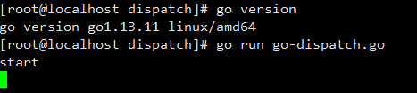
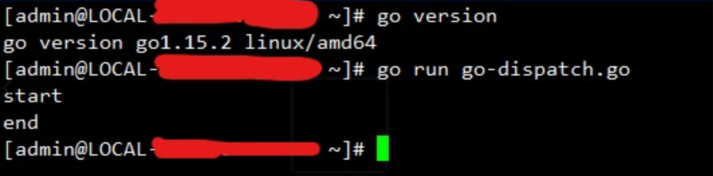

# go 1.14新特性抢占式调度

## 概要
关于go1.14版本的调度的新特性，1.14中引入了基于系统信号的异步抢占调度，使得无函数调用的死循环goroutine可以被抢占
## 代码示例
```go
package main

import (
	"fmt"
	"runtime"
	"time"
)

func main() {
	runtime.GOMAXPROCS(1)
	fmt.Println("start")
	go func() {
		for {

		}
	}()
	time.Sleep(time.Second)
	fmt.Println("end")
}
```
在go1.13版本运行的结果

go1.15中运行的结果

在1.14之前的版本中那个死循环goroutine会一直占据一个P导致其他个goroutine不能被调度(非抢占式的调度)


