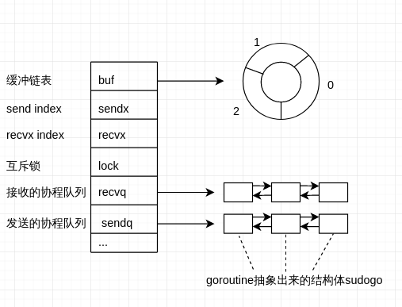

# channel的结构和原理
go中的goroutine和channel是一个特色的东西

代码结构
```go
// channel的底层数据结构
// channel就是一个循环队列，加锁，轻量级的锁
//
type hchan struct {
	qcount   uint           // total data in the queue  队列中数据的数量
	dataqsiz uint           // size of the circular queue 循环数组的长度
	buf      unsafe.Pointer // points to an array of dataqsiz elements 循环数组
	elemsize uint16         // 元素大小
	closed   uint32         // 关闭的标志
	elemtype *_type         // element type， 元素类型
	sendx    uint           // send index 已发送元素在循环数组中的索引
	recvx    uint           // receive index 已接收元素在循环数组中的索引
	recvq    waitq          // list of recv waiters  读操作阻塞在channel的g队列
	sendq    waitq          // list of send waiters  写操作阻塞在channel的g队列

	// lock protects all fields in hchan, as well as several fields in sudogs blocked on this channel.
	//
	// Do not change another G's status while holding this lock (in particular, do not ready a G),
	// as this can deadlock with stack shrinking.
	lock mutex
}

// 等待队列的结构体
type waitq struct {
	first *sudog
	last  *sudog
}

```
结构图


通过结构图和代码可以看到channel中是有两个goroutine的等待队列的，当goroutine被阻塞的时候会把goroutine抽象成sudogo保存在发送或在接收队列中，当有相应的接收或发送时，会将等待的goroutine唤醒

## channel在接收队列被唤醒
当channel中没有数据的时候，等待接收的goroutine会被阻塞
```shell
G1是接收，当channel中没有数据的时候，G1会被挂起让出M
G1和空元素会被抽象成sudogo，放入接收等待队列
G2这时向channel中发送数据时，不将数据放入channel的缓冲区，而是直接copy到G1的栈中
然后就会唤醒G1，将G1放入可运行队列
```

发送等待和这个不同的是G1和数据会被抽象称sudogo，G2会从缓存队列中取出数据，然后channel会将G1推出，进入可运行队列

[参考](https://juejin.cn/post/6844903821349502990#heading-0)


