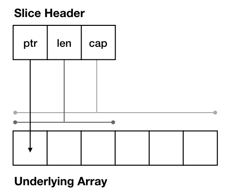

[原文地址](https://dave.cheney.net/2018/07/12/slices-from-the-ground-up)
[译文](https://mp.weixin.qq.com/s/A5hyvYdqsGcntbZlJyB3Iw)
## 数组
每次关于go切片讨论的都是从讨论一些不是切片的东西开始的，就是go的数组类型。数组在go中有两个特性：
1. 他们有固定的大小；[5]int即是一个包含5个int的数组，又不同于[3]int
2. 他们是值类型；考虑下面的例子
```go
package main

import "fmt"

func main() {
        var a [5]int
        b := a
        b[2] = 7
        fmt.Println(a, b) // prints [0 0 0 0 0] [0 0 7 0 0]
}
```
这个表达式b:=a声明了一个新的变量[5]int的变量b并且将a的内容拷贝到b。更新b不会影响a的内容，因为a和b是独立的值。

**作者注:** 这不是一个独特的属性，在go中每一个赋值都是拷贝。
## 切片
go的切片类型和数组类型有两个不同点：
1. 切片没有固定的长度。切片的长度没有被声明为其类型的一部分，而是被保留在切片的内部可以通过内置的len函数获取。
2. 将一个切片赋值给另一个切片的时候，不会创建前一个切片的副本。这是因为切片不是直接的拥有自己的内容。切片保存了一个指向底层数组的指针，这个数组保存了切片的内容。
作为第二个特性的结果，两个切片可以共享一个底层数组。看下面的例子：

**例1 对切片在切片**
```go
package main

import "fmt"

func main() {
        var a = []int{1,2,3,4,5}
        b := a[2:]
        b[0] = 0
        fmt.Println(a, b) // prints [1 2 0 4 5] [0 4 5]
}
```
在上面的例子a和b共享相同的底层数组尽管b开始是在不同的数组下标和不同的长度。改变b的底层数组对于a是可见的。
**例2 切片做为函数参数**
```go
package main

import "fmt"

func negate(s []int) {
        for i := range s {
                s[i] = -s[i]
        }
}

func main() {
        var a = []int{1, 2, 3, 4, 5}
        negate(a)
        fmt.Println(a) // prints [-1 -2 -3 -4 -5]
}
```
这个例子中是将a传递negate作为一个形参。negate中对s进行了遍历并对他们进行取反。虽然这个negate没有返回值，或者有任何的方法去访问main中的a变量，但是a的内容被negate改变了。
大多数的程序员对于go切片的底层数组有直观的了解，因为这类概念在其他语言中也有。例如第一个例子使用的python
```python
Python 2.7.10 (default, Feb  7 2017, 00:08:15) 
[GCC 4.2.1 Compatible Apple LLVM 8.0.0 (clang-800.0.34)] on darwin
Type "help", "copyright", "credits" or "license" for more information.
>>> a = [1,2,3,4,5]
>>> b = a
>>> b[2] = 0
>>> a
[1, 2, 0, 4, 5]
```
在ruby中也一样：
```ruby
irb(main):001:0> a = [1,2,3,4,5]
=> [1, 2, 3, 4, 5]
irb(main):002:0> b = a
=> [1, 2, 3, 4, 5]
irb(main):003:0> b[2] = 0
=> 0
irb(main):004:0> a
=> [1, 2, 0, 4, 5]
```
同样适用于大多数将数组视为对象或者引用类型的语言。
## 切片的头
切片既表现为值又表现为指针的神奇之处实际在于理解切片实际是一个结构体。想要理解这个需要看到切片的底层结构。
```go
package runtime

type slice struct {
        ptr   unsafe.Pointer
        len   int
        cap   int
}
```

这块是很重要的，因为不像map和chan是引用类型，切片是值类型并且在赋值或者作为参数传递给函数是进行拷贝的。
举例说明，程序员直观的理解square的形式参数v是main中声明的变量v的拷贝。
```go
package main

import "fmt"

func square(v int) {
        v = v * v
}

func main() {
        v := 3
        square(v)
        fmt.Println(v) // prints 3, not 9
}
```
因此square中对于v的操作是不会影响到main中的v。同样的double的形参s是来自于main中的s的值拷贝，不是main中s的指针。
```go
package main

import "fmt"

func double(s []int) {
        s = append(s, s...)
}

func main() {
        s := []int{1, 2, 3}
        double(s)
        fmt.Println(s, len(s)) // prints [1 2 3] 3
} 
```
go的切片变量有些不同寻常，他是通过值传递而不是指针。90%的的情况下你声明一个go的struct，你将通过struct的指针进行传递而不是值。go中直接传递结构体值得例子是很罕见的，我能想到的就是time.Time。
切片作为值得这种异常行为，而不是指向值得指针，这个会使得go程序员们会有疑惑对于理解切片如何工作。仅仅记住每次分配二次切片，或者传递或者返回一个切片，你是在复制切片头的


