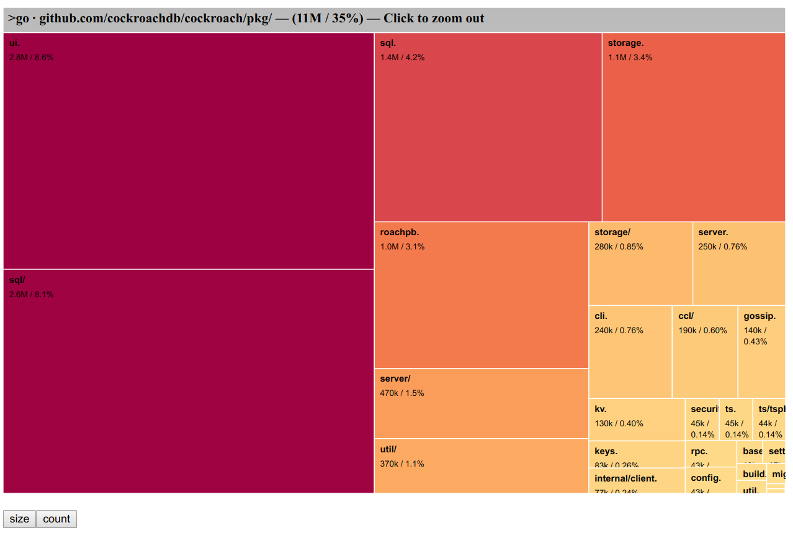

[原文地址](https://dr-knz.net/go-executable-size-visualization-with-d3.html)
## 摘要
我有构建了一些小工具用于提取go的可执行文件的细节，并构建了一个D3的小应用交互式的将这些信息可视化为可缩放的树的映射。
下面是一个截图用于展示这个工具如何展示编译代码所占的大小，这是根据CockroachDB的一个组模块得来的：

做这个的原因是，用于帮助我发现并且学习为什么go可执行文件的大小超过了我的预期。感谢这个工具，我对go如何构建可执行文件有了更多的发现。
想知道我发现了什么吗(继续往下看)
[源代码地址]( https://github.com/knz/go-binsize-viz)
## 背景和动机
我和我的同事正在忙着准备发布CockroachDB的最新19.1版本。CockroachDB是作为一个包含了所有功能的可执行文件发布的。
今天，这个最新的版本是123MB大，去掉88MB。这是94%增加了（125%）从1.0版发布，大了很多超过了两年前。什么有发生呢？
这是特别令人迷惑的：
- 目前的19.1版本的源代码大约是70MB，在1.0中的源代码是50MB。这个增加的仅仅是40%。为什么二进制文件增加了那么多呢？
- 通常编译后的代码要比编译后的源代码要小的。这个源码有70MB其中还有大量的注释。但是这个二进制是88MB。什么使得这个可执行文件超过了源码？
光这些问题就使我充满了好奇。
同时，出于实际的原因我也关心这个程序的大小：更小的二进制文件可以减少内存的抖动。更容易分发和部署。使容器编排跟灵活。因为这些原因，我希望发布的二进制文件更小。弄清楚他们包含了可能会建议如何实现它。
## 构建可视化
### 方法
我的目标是让123MB难以理解的可执行数据变得清晰。一开始不并不知道如何实现它。
我知道Unix中有标准的工具nm可以是显示可执行文件的单个条目的大小，并且我知道go中也自己重新实现了一个不成熟(go的工具集 go tool nm)。但是，即便是一个很小的go程序都包含几十个条目，而我正在查看的这个特定文件中有成千上万个条目。因此我需要一个概要信息。
自从电影侏罗纪推出了fsn3D浏览器以后我就知道了树图。可视化的表示大小不同的分层条目，例如磁盘文件，在我的例子中将可执行文件的条目显示在屏幕上，在屏幕的大小和其所占的磁盘大小成比例。
我决定去将他们联系起来：使用树图将go的二进制文件进行可视化。
此时我提醒自己，有成千上万的条目需要可视化，我事先知道，把他们同事显示在屏幕上对我是没有好处的。于是我开始寻找可以缩放的树图。
最后，我已经学习了一些D3的知识，我还想学的更多，因此我决定使用D3为了这次练习。
我在最喜欢的浏览器上搜索为了可缩放的D3的树图，发现有的D3的原生支持，以适当的格式提供输入数据。
一开始我想修改一下` Mike Bostok’s zoomable treemaps `很快我就发现了一些问题，我想使用的一些D3特性不能被使用：Mike的代码使用的D3V3，现代的D3是运行在V5，他们之间主要的API是有改变的介于V3和V4之间。将V3的例子转化到V4(V5)似乎并不简单。我又开始寻找一些为了V4+构建的例子。我发现了一个示例来自Jahnichen Jacques，它本身又是启发于Mike Bostok和一个更简单的Guglielmo Celata例子，但是他的实现更简单。
所有的示例都是使用带有特定的模式CSV或者JSON加载的D3层次数据集工作。
因此主要思考的是将nm输出的数据如何格式化成适合D3的格式。剩下的工作相对简单了，就是将我在网上收集的示例格式修改为适应我收集的数据类型。
### 提取可执行项
根据go tool nm -size的结果可以看到一个go的可执行文件包含两种类型的条目：
- 从go编译的条目，看起来是这样的
 `10ddac0         17 t github.com/cockroachdb/cockroach/pkg/base.(*ClusterIDContainer).Unlock`
- cgo条目编译通过C/C++，或者go的程序中有引入了外部的C/C++库。这些看起来是这样(模板过滤使用c++filt)：
`28404a0         44 T rocksdb::PosixDirectory::~PosixDirectory()`
第一列表示地址，在这里我们是没有兴趣的。第二列是大小。第三列是条目类型我们也是没有兴趣的。最后一部分是条目的符号。
因此为了构建可视化树，我们需要将每个符号组件分解成名称组件，然后将名称组件进行分层。

