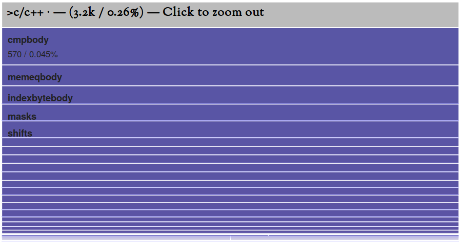

[原文地址](https://dr-knz.net/go-executable-size-visualization-with-d3.html)
## 摘要
我有构建了一些小工具用于提取go的可执行文件的细节，并构建了一个D3的小应用交互式的将这些信息可视化为可缩放的树的映射。
下面是一个截图用于展示这个工具如何展示编译代码所占的大小，这是根据CockroachDB的一个组模块得来的：

做这个的原因是，用于帮助我发现并且学习为什么go可执行文件的大小超过了我的预期。感谢这个工具，我对go如何构建可执行文件有了更多的发现。
想知道我发现了什么吗(继续往下看)
[源代码地址]( https://github.com/knz/go-binsize-viz)
## 背景和动机
我和我的同事正在忙着准备发布CockroachDB的最新19.1版本。CockroachDB是作为一个包含了所有功能的可执行文件发布的。
今天，这个最新的版本是123MB大，去掉88MB。这是94%增加了（125%）从1.0版发布，大了很多超过了两年前。什么有发生呢？
这是特别令人迷惑的：
- 目前的19.1版本的源代码大约是70MB，在1.0中的源代码是50MB。这个增加的仅仅是40%。为什么二进制文件增加了那么多呢？
- 通常编译后的代码要比编译后的源代码要小的。这个源码有70MB其中还有大量的注释。但是这个二进制是88MB。什么使得这个可执行文件超过了源码？
光这些问题就使我充满了好奇。
同时，出于实际的原因我也关心这个程序的大小：更小的二进制文件可以减少内存的抖动。更容易分发和部署。使容器编排跟灵活。因为这些原因，我希望发布的二进制文件更小。弄清楚他们包含了可能会建议如何实现它。
## 构建可视化
### 方法
我的目标是让123MB难以理解的可执行数据变得清晰。一开始不并不知道如何实现它。
我知道Unix中有标准的工具nm可以是显示可执行文件的单个条目的大小，并且我知道go中也自己重新实现了一个不成熟(go的工具集 go tool nm)。但是，即便是一个很小的go程序都包含几十个条目，而我正在查看的这个特定文件中有成千上万个条目。因此我需要一个概要信息。
自从电影侏罗纪推出了fsn3D浏览器以后我就知道了树图。可视化的表示大小不同的分层条目，例如磁盘文件，在我的例子中将可执行文件的条目显示在屏幕上，在屏幕的大小和其所占的磁盘大小成比例。
我决定去将他们联系起来：使用树图将go的二进制文件进行可视化。
此时我提醒自己，有成千上万的条目需要可视化，我事先知道，把他们同事显示在屏幕上对我是没有好处的。于是我开始寻找可以缩放的树图。
最后，我已经学习了一些D3的知识，我还想学的更多，因此我决定使用D3为了这次练习。
我在最喜欢的浏览器上搜索为了可缩放的D3的树图，发现有的D3的原生支持，以适当的格式提供输入数据。
一开始我想修改一下` Mike Bostok’s zoomable treemaps `很快我就发现了一些问题，我想使用的一些D3特性不能被使用：Mike的代码使用的D3V3，现代的D3是运行在V5，他们之间主要的API是有改变的介于V3和V4之间。将V3的例子转化到V4(V5)似乎并不简单。我又开始寻找一些为了V4+构建的例子。我发现了一个示例来自Jahnichen Jacques，它本身又是启发于Mike Bostok和一个更简单的Guglielmo Celata例子，但是他的实现更简单。
所有的示例都是使用带有特定的模式CSV或者JSON加载的D3层次数据集工作。
因此主要思考的是将nm输出的数据如何格式化成适合D3的格式。剩下的工作相对简单了，就是将我在网上收集的示例格式修改为适应我收集的数据类型。
### 提取可执行项
根据go tool nm -size的结果可以看到一个go的可执行文件包含两种类型的条目：
- 从go编译的条目，看起来是这样的
 `10ddac0         17 t github.com/cockroachdb/cockroach/pkg/base.(*ClusterIDContainer).Unlock`
- cgo条目编译通过C/C++，或者go的程序中有引入了外部的C/C++库。这些看起来是这样(模板过滤使用c++filt)：
`28404a0         44 T rocksdb::PosixDirectory::~PosixDirectory()`
第一列表示地址，在这里我们是没有兴趣的。第二列是大小。第三列是条目类型我们也是没有兴趣的。最后一部分是条目的符号。
因此为了构建可视化树，我们需要将每个符号组件分解成名称组件，然后名称组件将这些符号分组为层次结构。
### 分解go的符号
直觉告诉我一个go的符号应该包含一个带分层的包的路径(e.g. github.com/lib/pq)和一个包的名字。这个包名要不是一个全局的名字在包中(如. main)或者就是带有接收方类型前缀的方法名 (e.g. (*File).Write)。
这个模型可以对大多数的符号进行精准描述并且可以很容易的使用一个正则表达式进行分解。但是很快我就发现了一些不符合这种模式的外来名字：
```
5250978         13 d crypto/tls..gobytes.1
3823b40         48 r go.itab.*compress/flate.byLiteral,sort.Interface
     aa3740        113 t go.(*struct { io.Reader; io.Closer }).Close
     e79cb0         10 t database/sql.glob..func1
     8ce580        123 t encoding/json.floatEncoder.encode-fm
     73aed0         82 t runtime.gcMarkDone.func1.1
```
我反复的扩展一个简单地正则表达式使得可以正确的分解go二进制中的各种名称。结果正则表达很复杂可以被找到。[结果](https://github.com/knz/go-binsize-viz/blob/d9d15ccf1569747ac4f2ff643a56954c793ce56c/tab2pydic.py#L119-L184)
对于上面的例子我的程序生成了下面的东西：
|大小|路径|名字|
|-|-|-|
|13|['crypto/', 'tls.', '.gobytes.']|1|
|48|['compress/', 'flate.']|go.itab.*byLiteral,sort.Interface|
|113|	['go.', '(*struct { io.Reader; io.Closer }).']|Close|
|10|['database/', 'sql.', 'glob..']|func1|
|123|['encoding/', 'json.', 'floatEncoder.']|encode-fm|
|82|['runtime/', 'gcMarkDone.', 'func1.']|1|
### 分解C/C++的符号
直觉告诉我一个C/C++的符号包含一个分层的命名空间的路径(e.g. std:: or google::protobuf::)或者一个变量或者方法的名字。
看一看真实的二进制文件，可以发现很多不符合这个简单模型的项：
```
37ee1d0          8 r $f64.c05eb8bf2d05ba25
26abe20        100 T void rocksdb::JSONWriter::AddValue<int>(int const&)
28388f0         71 t rocksdb::(anonymous namespace)::PosixEnv::NowNanos()
2821ae0        231 T rocksdb::NumberToString[abi:cxx11](unsigned long)
 5b8c5c         34 t rocksdb::PosixRandomRWFile::Sync() [clone .cold.88]
265a740        211 T google::protobuf::internal::LogMessage::operator<<(long)
```
使用相同的方法，我使用一个简单的正则表达式来迭代的分解遇到的多样的符号。我甚至跟进一步，选择在下划线边界处分解标识符。结果这个正则表达式相当的复杂，[正则](https://github.com/knz/go-binsize-viz/blob/d9d15ccf1569747ac4f2ff643a56954c793ce56c/tab2pydic.py#L7-L117)
为了上面的例子，我的生成的在下面：
|大小|路径|名字|
|-|-|-|
|8|['$f64.']|c05eb8bf2d05ba25|
|100|['rocksdb::', 'JSONWriter::']|	void AddValue<int>(int const&)|
|71|['rocksdb::', '(anonymous namespace)::', 'PosixEnv::']|NowNanos()|
|231|['rocksdb::', 'PosixRandomRWFile::']|Sync() [clone .cold.88]|
|211|['google::', 'protobuf::', 'internal::', 'LogMessage::']|operator<<(long)|
C++的符号在类型中可以包含任意数量的嵌套模板参数或者括号，并且正则不能进行递归，使得产生了一些困难。
因此我当前的实现被限制只可以最多6层嵌套。这似乎不足以捕获我所感兴趣的所有的符号(一些符号是有包含10层嵌套)但是我选择排除一些符号以保持我的正则表达式简单。在我分析的目标中这些被排除的符号大小是可以被忽略不计的。
### 组织这些数据成为一个树
最后分解每一个符号的路径分量后，我的程序使用一个简单递归函数创建了一个嵌套的Python字典。
然而对于路径a，b，c这个策略的结果是这样的：
```
{'children':{
        'a':{'children':{
                'b':{'children':{
                      'c': ...
                      }}
             }}
}}
```
这个D3想要的是这样的：
```
{'children':[
        {'name':'a', 'children':[
                {'name':'b', 'children':[
                       {'name':'c', ... }
                      ]}
             ]}
]}
```
为此我构建了一个单独的简化程序转化前者的格式为后者。
将代码分开的原因是符号分解的开销是相当大的，一旦分解出我满意的结果，我就希望在树的转化时进行快速迭代，而不需要一次又一次的进行分解。
此外，简化程序将具有单个子元素的多个层次结构分解为具有组合名称的一个级别。例如这个层级`a/ → b/ → c/ → x,y`变成`a/b/c/ → x,y`。
### 使用D3
D3树始创于 Mike Bostok，然后被Jahnichen Jacques和Guglielmo Celata进行改进示例如下：
1. 在HTML实体中创建一个SVG画布；
2. 有定义了显示方法，给予一个计算的D3树图布局，将在SVG中创建一个3层的可视化；
3. 这个显示方法内部默认定义了单机画布时缩放的逻辑；
4. 加载来时json的数据，附加到D3树图的布局中，并使用前面提到的工具渲染。
在前作者的逻辑上我又新加了一些：
- 同时使用绝对值和百分比显示大小
- 稳定的彩色图
- 有在可视化大小和数量之间有切换的能力
- 可以在同一个web页面查看多个数据集。
## 简单示例为了可视化
### 例子程序
我们将使用下面的代码：
```go
package main

import "fmt"

var x = struct { x [10000]int }{}

func main() {
        fmt.Println("hello world", x)
}
```
我选择使用一个大的结构体为了变量X，这样主体代码的大小就会比导入的runtime对象大。
他可以被编译：
```shell
go build hello.go
```
### 转换过程
我们使用下面的命令：
```shell
$ go tool nm -size hello            >hello.symtab
$ python3 tab2pydic.py hello.symtab >hellodic.py
$ python3 simplify.py hellodic.py   >hello.js
```
### 可视化
一下的html已经足够了：
```html
<html>
  <head>
       <meta http-equiv="Content-Type" content="text/html; charset=UTF-8">
       <link rel="stylesheet" type="text/css" href="treemap.css">
  </head>
  <body>
       <p class="chart" id="chart"></p>
       <script src="js/d3.v4.min.js" type="text/javascript"></script>
       <script src="js/d3-color.v1.min.js"></script>
       <script src="js/d3-interpolate.v1.min.js"></script>
       <script src="js/d3-scale-chromatic.v1.min.js"></script>
       <script src="app3.js" type="text/javascript"></script>
       <script type="text/javascript">
         viewTree("chart", "example-data/hello.js");
       </script>
  </body>
</html>
```
看下面的渲染效果(确保启用了JavaScript)

尽管这个简单的可执行文件仅仅包含了GO的符号，实际上他也有包含了C/C++的符号。但是他们的大小是很小的并且他们最初被呈现只是在树图的右侧的一条线。通过点击那条线，你可能通过放大会得到他们并且包含这个：

### 第一印象
这个小程序包含了6行代码并且编译成了一个1.3MB的二进制文件。这个大小的分布如下：
|包名|大小|
|-|-|
|runtime|900k/71%|
|main|80k/6.3%|
|unicode|77k/6.1%|
|reflect|72k/5.7%|
|fmt|38K/3.0%|
|strconv|31k/2.5%|
|sync|10k/0.8%|
|internal|9k/0.7%|
|syscall|6k/0.5%|
|others|remainder|
除了从源代码中编译的，还有24k(1.9%)是编译产生的类型相等和散列函数。这些都在树图的TYPEBOX框中累计。
看下面的内容就很快清楚了：
- go的标准库没有很好的模块化；仅仅导入了一个方法(fmt.Println)就拉了大约300k的代码
- 甚至对于fmt.Println和他的依赖以及主程序的80K可预测，我们对有900k(71%)的代码来自runtime包是感到疑惑的。
- 通过缩放我们有看到450K(35%)是被一个名为runtime.pclntab单独的条目占用。这个是超过了主程序和为了fmt.Println的支持代码的总和。
我们将在下面回答这个问题。
## CockroachDB的可执行文件包含什么？
### 可视化探究
在最近构建的CockroachDB中运用这个工具，可以发现下面的：
### 分析
通过探索这个图，我发现：
- 总的条目是71MB
- C/C++的条目占8.4MB(12%),其中包含3M(4.3%）来自RocksDB
- 62M(88%)是GO的条目，包含：
	- 32M(45%)是直接来自CockroachDB的代码和他的依赖
	- 26M(36%)来自runtime包
通过上面的例子，他的runtime是900K。现在这个是26MB有增大了28倍。到底发生了什么？
放大后谜底揭开了：所有的增加的都进入了一个单一对象runtime.pclntab。其他的条目在runtime包中没有显示出不同在两个程序之间。
稍后我们将回到这个对象。
### CockroachDB的版本比较
上面的可视化使用的是V19.1版本。作为参考，这里使用v1.0版本：
- 总的条目为32MB
- C/C++的条目是2.5M(7.8%),包含1.5M(4.7%)的RocksDB
- 32MB(92%)go的条目包含：
	- CockroachDB和他的依赖是16M(50%)
	- runtime包是7.9M(25%),其中7.3MB(23%)直接来自pcltab
回想最初的问题，CockroachDB大约增加了40%的源代码v1.0到v19.1。感谢这个可视化，我们观察到这个直接来自CockroachDB的编译代码的增加16M到32M增加了一倍。
同时，pcltab增加7.9M到26M是有增加了230%。
## runtime.pcltab是什么呢？
他不是很好的记录，但是从go源码中的注释暗示了这个的目的
```
LineTable是一种将程序计数器映射到行号的数据结构。
```
这个数据结构的目的能够使得go的运行时系统在崩溃时或者调用内部通过runtime.GetStack可以生成栈的追踪描述。
这个似乎是有用的。但是为什么这么大呢


