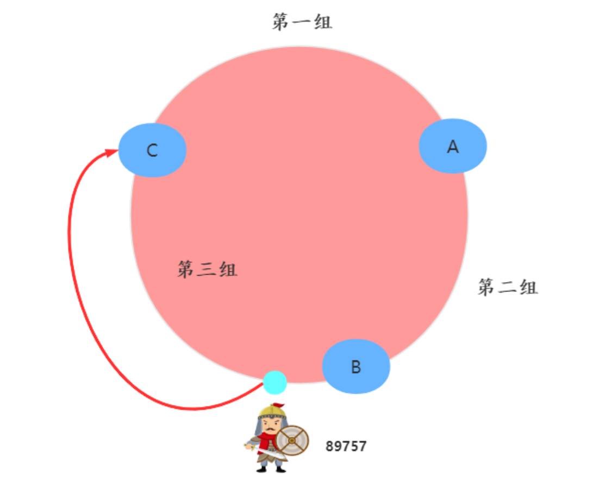
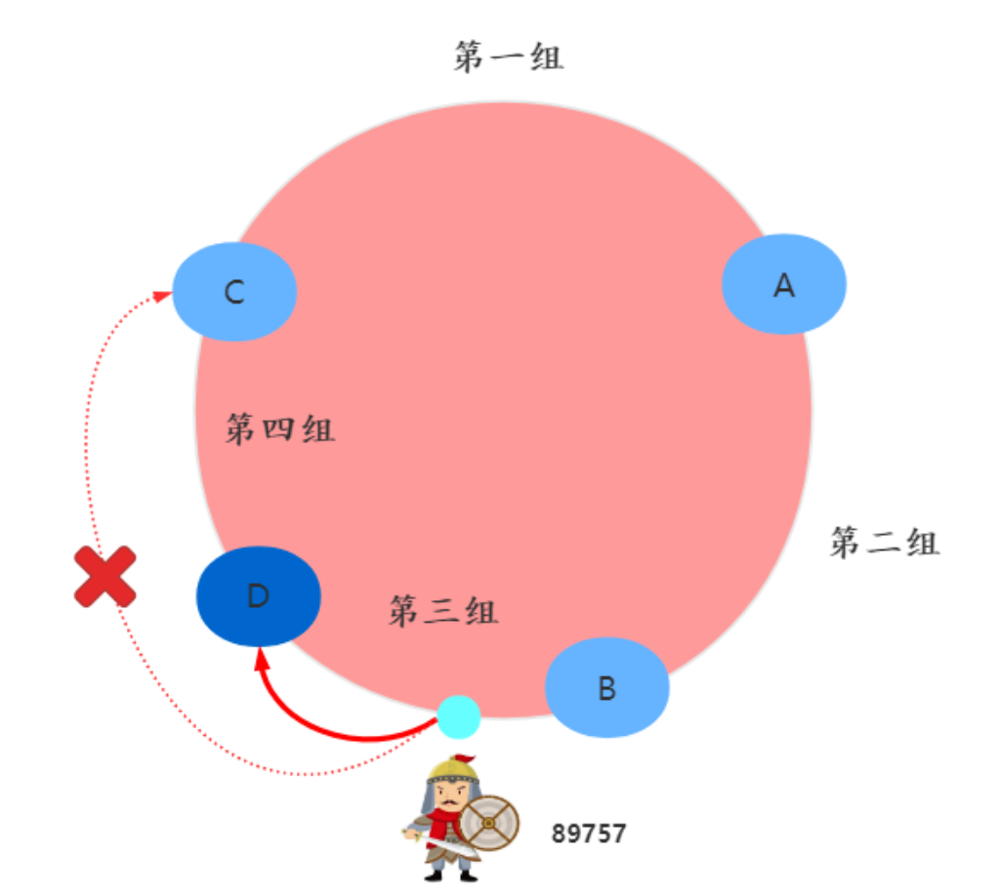
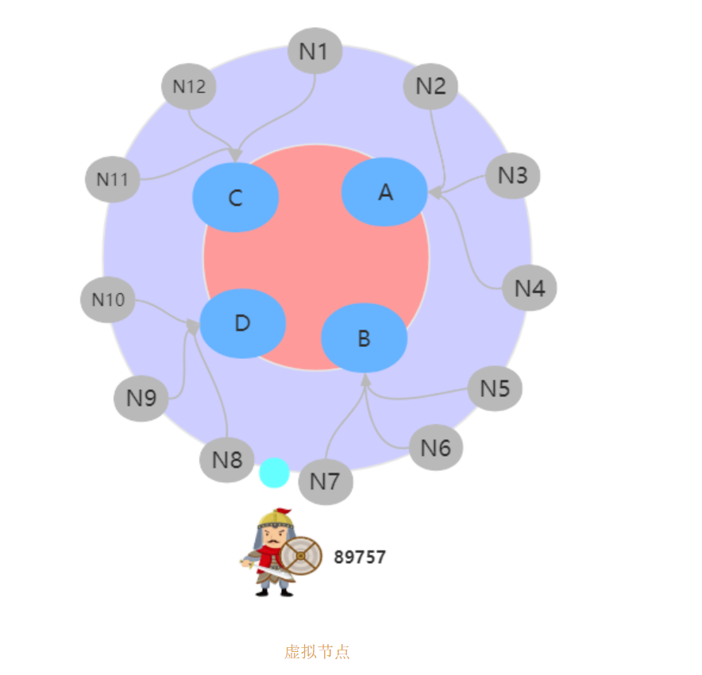

# hash
在实际的使用中经常会用到hash，特别是绝大部分分布式系统中会添加或着删除节点都会面临数据的迁移。
思考：如何使得数据分布均匀并且在增加或者减少节点的时候使得数据迁移量最少

## hash算法
可以在数据和节点确定的情况下将数据均匀的分配到每个节点上，但是当节点数量有变化的时候，这个时候就会出现大量数据迁移，从而导致性能的问题。
## 一致性hash
通过对hash算法的改进，使得节点数有变化的时候尽可能的降低数据迁移量
使用了哈希环，将节点分布在一个环上，出现在区间上的数据都是属于顺时针遇到的第一个节点

如图：

当加一个节点的时候

这个时候可以看到区间的分布是不均衡的，这样是会导致数据不均匀，但是这个时候只是需要迁移一部分的C上的节点。
## 虚拟节点
为了解决上面出现的数据分布不均匀的问题，又提出量虚拟节点的概念，虚拟节点要比真实的节点数目要多，均匀的分布在哈希环上

由于虚拟节点实际的区间相对较小，这样数据分布将会比较均匀也使得数据迁移量较小。
在实际使用中虚拟节点和真实节点之间应该打乱而不是向上图那样，可能出现N6对应A，N10对应A这样，这样可以保证在添加或者缩小的时候尽量均匀。

一致性哈希算法就是一种路由寻址，适合简单的路由寻址场景，常用在负载均衡的架构设计中。

## 参考
[韩信大招之一致性哈希](https://mp.weixin.qq.com/s/eAQ1_Lsmd57DJWMFH60cgQ)
[一致哈希go的实现](https://mp.weixin.qq.com/s?__biz=MzAxMTA4Njc0OQ==&mid=2651440746&idx=2&sn=1491963e2132b4de2f90d0d21161dd1f&chksm=80bb1898b7cc918e959b43ffb355193a2d46791745303393b4490176253924638d8fb1c01836&scene=21#wechat_redirect)

