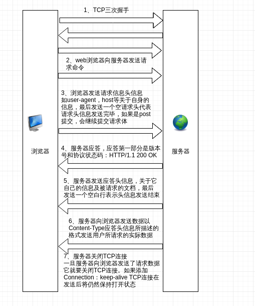
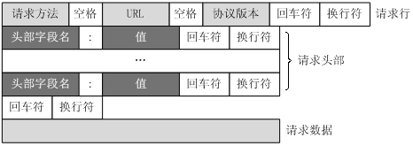

# http的请求过程
介绍一个http请求的响应全过程，从建立连接到数据发送在到连接断开的整个过程。
## 连接建立

从图中可以看到一个http请求，先是经过三次握手，然后客户端向服务器发送请求命令

我们在浏览器输入URL并按下回车，开始我们的http请求的时候，的步骤：

1. 通过URL找到IP，首先是本地缓存(Hosts文件url和ip的对应关系),路由器缓存，向上层DNS服务器询问，要是一直没有找到就到根DNS中找
2. 对找到的IP建立TCP连接
3. 向服务器发送数据
4. 服务器解析并返回
5. 浏览器解析HTML

## http请求报文
http请求报文由请求行(request line)、请求头部(header)、空行和请求数据4部分组成

## http发展历程

## 参考
[http请求的过程](https://zhuanlan.zhihu.com/p/38240894)

