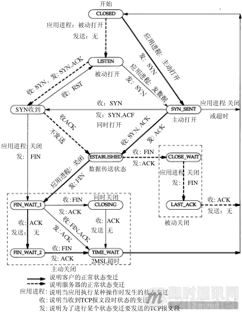

# 连接的建立与终止
[TCP/IP详解目录](http://www.52im.net/topic-tcpipvol1.html)
[第十八章](http://docs.52im.net/extend/docs/book/tcpip/vol1/18/)
## 摘要
TCP是面向连接的，因此使用TCP进行传输数据的时候是需要有建立连接和终止连接的过程。
探寻连接建立和终止的过程。

## 连接的建立

## 连接的终止

## 最大报文长度
最大报文长度(MSS)
## TCP的状态迁移图

