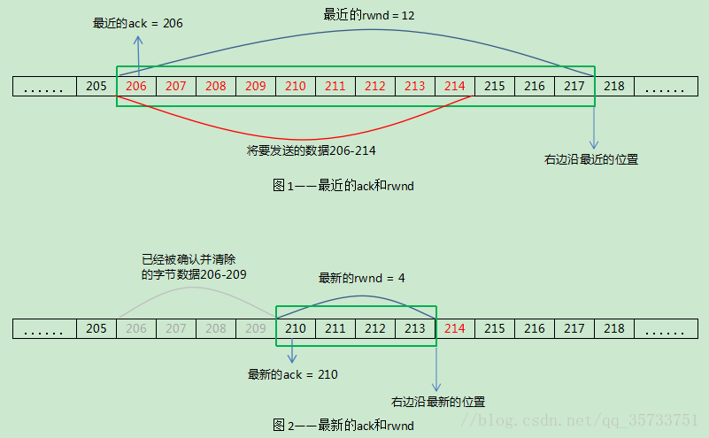

# TCP交互数据流
[TCP/IP详解目录](http://www.52im.net/topic-tcpipvol1.html)
[第十九章](http://docs.52im.net/extend/docs/book/tcpip/vol1/19/)
## 摘要
目前建立在TCP协议的网络协议特别多，telnet，ssh，FTP，POP3，HTTP等。
这些协议可以根据数据吞吐两大致分为两类：
- 交互数据流：例如：telnet，ssh这些协议在大多数情况下只是小流量的数据交换，键盘的输入或在回显。
- 成块数据流：例如：ftp等协议需要TCP尽可能的装载在更多的数据(一般只满载数据，提高吞吐量)，这样来提高数据传输效率
对于这两种不同类型TCP有着不同的传输策略。
## 交互数据流
一般交互数据流都是一个发送一个确认这样的，比如键盘的输入。这样难免在一些交互性要求较高的情况下效率很低，这时TCP给出了两种策略：
- 稍带ACK，(在服务端发给客户端的包中带上ACK)
- Nagle算法(一次尽量多的发送数据)
### 稍带ACK
这种方式就是在收到包以后不马上返回ACK确认包，而是和发送的数据包一起返回(稍带返回)。不过这个一般会有一个最大时间(200ms)，如果到了时间还没有数据需要一起返回这时就主动返回ACK。
### Nagle算法
由于很多交互式的方式会产生很多微小分组,在局域网不会引起问题，但是当了广域网中这些小分组可能会导致拥塞的出现。
Nagle算法要求一个TCP连接上最对只能有一个未被确认的未完成的分组，该分组到达之前不会发送新的分组，在确认到达之前就会将那些小的分组进行合并，然后以一个分组的方式发送出去。
优点：可以进行自适应，确认到达的越快，数据发送的就会越快
缺点：会造成一些时延
有时候是需要关闭Nagle算法的，比如X窗口系统服务器：鼠标在移动的时候就必须是无时延的。这时是可以通过插口API用户可以使用TCP_NODELAY选项来关闭Nagle算法。
## 成块数据流
对于FTP等需要传输大量数据的协议时，每次总是希望一次多发一些数据的即便确认延迟一会也是没有关系的。在TCP中也是有一整套协议去支承的，核心在于TCP头部的16位的窗口大小了。
### ACK确认问题
一般理解接收方每收到一个包的时候就会回复。实际中是发送方尽可能将接收方的缓冲区填满，然后接收方回复一个ACK确认，这样减少了双方的压力。ACK是会进行累积的。
### 滑动窗口
滑动窗口就是接收方告诉发送方当前自己的缓冲区还剩多少，发送方会根据这个大小进行发送数据，如果这个为0的时候发送方就会停止发送数据的
对于窗口的三种不同描述：
- 窗口合拢：左边沿向右移动表示窗口合拢，发生在数据被确认和发送时
- 窗口扩张：右边沿向右移动表示窗口扩张，发送在接收端读取数据并将缓冲区释放的过程
- 窗口收缩：右边沿向左移动表示窗口收缩，对于接收方的窗口RFC是不建议进行收缩的，发送的可以收缩但是在实际使用中也是不会收缩的

TCP就是用这个窗口来控制数据的发送的，慢慢的从数据的左边移动到右边，把处于窗口范围的数据发送出去(只是可以发送而不是一定要发送)。窗口的大小是socket制定的，默认的4096并不是最理想的大小，16384可以增加40%的吞吐量
**窗口收缩**
发送方的发送窗口是由接收方发送的rwnd来设置的，当窗口收缩的时候是会出现一些问题的，通过下图如果窗口收缩以后214的这个包将会在窗口的外面而不能被确认，但是这个包已经发送了出去。

为了防止窗口收缩是通过一个公式去满足的：
`new ack + new rwnd > old ack + old rwnd` old表示最近的一个，只有满足了公式的才会向右边移动

