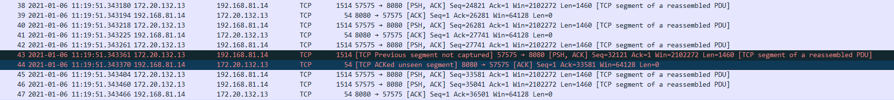
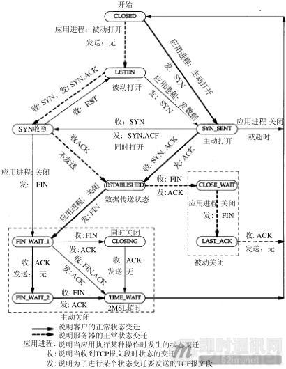
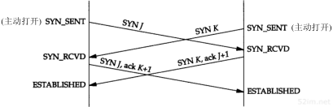
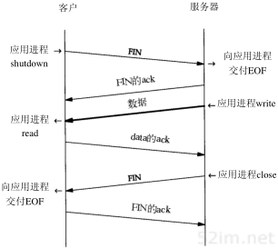
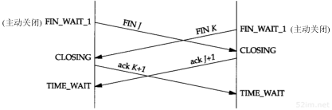
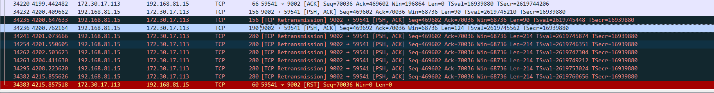
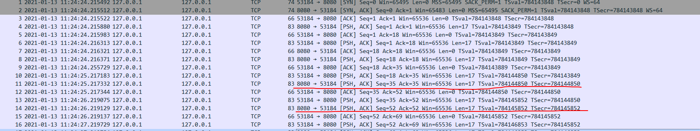
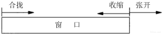
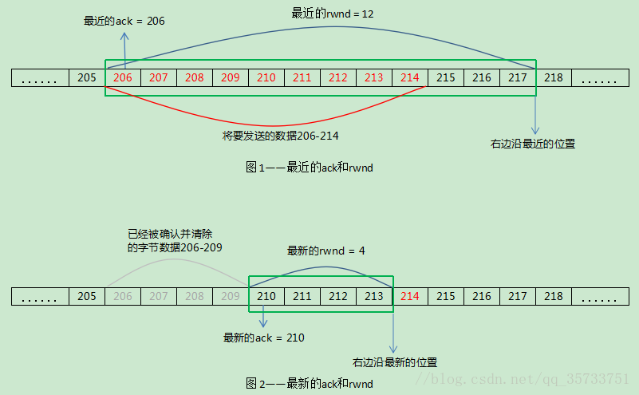

# 概要
主要分享以下几个部分：
1. tcpdump抓包
2. TCP连接的建立和断开
3. 交互数据流
## tcpdump抓包
`tcpdump tcp -i en0 -t -s 0 -c 100 and dst port ! 22 and src net 182.123.13.0/24 -w ./target.cap`
- tcp： 表示协议类型，总是在第一个，也可以是udp，ip等
- -i en0：表示只抓经过en0的包
- -t： 表示不显示时间戳，会显示具体时间
- -s 0: 表示抓取全部的包，默认是抓68个字节
- -c 100: 表示抓取100个包然后停止
- dst port ! 22: 表示不抓取目标端口是22的包
- src net 182.123.13.0/24: 数据包的源网络格式是182.123.13.0/24
- -w ./target.cap： 保存成cap文件

[wireshark中的提示](https://github.com/Alvin-Fu/notebook/blob/master/system/linux-command/tcpdump-wireshark.md)

### 抓包异常数据解读
#### 1、[TCP Previous segment not captured]丢包
TCP传输过程中数据包应该是连续的，后一个包的seq(n)=seq(n-1) + len(n-1),如果seq(n)>seq(n-1) + len(n-1)说明中间有一段数据丢失了。
[TCP Out-of-Order]表示包乱序了，比如seq(n) < seq(n-1)表示包的顺序错了
#### 2、[TCP Dup ACK x#y]
当乱序或在丢包发生时，接收方会收到一个比期望大的seq号。这时接收方会告知发送方当前他想要的包的seq
#### 3、[TCP Spurious Retransmission] 丢包重传
#### 4、[TCP Fast Retransmission] 快速重传
当发送方收到三个以上的[TCP Dup ACK]，就说明之前法的包可能丢了，于是快速重传他(RFC的规定)
#### 5、[TCP Retransmission]超时重传
如果一个包真的丢了，又没有后续包可以在接收方触发[Dup Ack],就不会快速重传，只能超时重传。
这时接收方和发送方之间没有其他包的往来，导致ACK和seq不能更新。
#### 6、[TCP ACKed unseen segment]
这个标志表示抓包发现被ack的包但是没有被抓到
42号包是序号27741 + 1460 = 29201 
说明29201到33581之间的数据没有抓到但是被确认了

## TCP连接的建立和断开
看一个TCP连接使用的过程
1. 建立连接
2. 发送方发送数据包，接收方收到后返回确认包，如果没有重新发，有就发送下一个
3. 接收方等待数据包，接收到时对数据包进行校验，符合就返回(ACK)确认包，并继续等待，直到收到FIN
4. 中止连接

**图中的其他状态**

- LISTEN--->SYN_SENT: 这个表示服务端有时候也时需要建立连接的
- SYN_SENT--->SYN收到：客户端和服务端如果在SYN_SENT状态时如果收到了SYN，都需要回复SYN的ACK，然后将自己调整到ESTABLIDSHED状态
- SYN_SENT--->CLOSED: 发送超时的情况下需要进入CLOSED
- SYN收到--->LISTEN: 表示收到了RST包，然后返回到LISTEN(当一方断电等情况，另一方不知道的时候，进行发包的时候另一端会返回一个RST包)
- SYN收到--->FIN_WAIT_1：在建立连接后不进行到ESTABLIDSHED状态，然后连接被关闭了
### 连接的建立

#### 同时打开

双方都发送，可以看到多了一个确认包，因为双方即是客户端又是服务端
### 连接的断开
四次挥手，主动断开的一方会进入到TIME_WAIT状态，一般都是客户端主动断开，防止服务端有过多的TIME_WAIT状态
FIN_WAIT_2状态，当进入这个状态的时候一直没有收到对方的FIN时，是不是就一直在这个状态呢
#### 半关闭状态
当一端发送完数据以后，还能收到另一端的数据

一般直接使用close是不会出现这种情况的，这个是需要socket那块支持提供给应用程序使得可以发送FIN而不是直接调用close
#### 同时关闭
当双方数据都发送完毕的时候，同时发送FIN，双方都会进入到TIME_WAIT状态，并且双方不会进入FIN_WAIT_2状态

#### RST的情况
通过抓包有时是可以看到出现RST包，RST包也是关闭连接的一种方式。
业务中遇到的就是客户端出现了网络问题，导致客户端将连接关闭，然后服务端没有感知到，并一直给客户端发包，当客户端恢复的时候服务端就收到了RST包

## 交互数据流
**思考：**
1. 抓包可以看到每收到一个包就会有一个确认回包，这种方式是最好的方式吗？

基于TCP协议的网络协议很多，telnet，ssh，ftp，pop3等
- 交互数据流：例如：telnet，ssh这些协议在大多数情况下只是小流量的数据交换，键盘的输入或在回显。
- 成块数据流：例如：ftp等协议需要TCP尽可能的装载在更多的数据(一般只满载数据，提高吞吐量)，这样来提高数据传输效率

### 交互数据流
一般交互数据流都是一个发送一个确认这样的，比如键盘的输入。这样难免在一些交互性要求较高的情况下效率很低，这时TCP给出了两种策略：
- 稍带ACK，(在服务端发给客户端的包中带上ACK)
- Nagle算法(一次尽量多的发送数据)
#### 稍带ACK的例子

可以看到8080到53184中的有些数据包是和ack包合并了
但是53184到8080之间的数据包还是分开的
#### Nagle算法
由于很多交互式的方式会产生很多微小分组,在局域网不会引起问题，但是当了广域网中这些小分组可能会导致拥塞的出现。
Nagle算法要求一个TCP连接上最对只能有一个未被确认的未完成的分组，该分组到达之前不会发送新的分组，在确认到达之前就会将那些小的分组进行合并，然后以一个分组的方式发送出去。

优点：可以进行自适应，确认到达的越快，数据发送的就会越快
缺点：会造成一些时延

有时候是需要关闭Nagle算法的，比如X窗口系统服务器：鼠标在移动的时候就必须是无时延的。这时是可以通过插口API用户可以使用TCP_NODELAY选项来关闭Nagle算法。

### 成块数据流
对于FTP等需要传输大量数据的协议时，每次总是希望一次多发一些数据的即便确认延迟一会也是没有关系的。在TCP中也是有一整套协议去支承的，核心在于TCP头部的16位的窗口大小了。
#### ACK确认问题
一般理解接收方每收到一个包的时候就会回复。实际中是发送方尽可能将接收方的缓冲区填满，然后接收方回复一个ACK确认，这样减少了双方的压力。ACK是会进行累积的。
#### 滑动窗口
滑动窗口就是接收方告诉发送方当前自己的缓冲区还剩多少，发送方会根据这个大小进行发送数据，如果这个为0的时候发送方就会停止发送数据的

对于窗口的三种不同描述：
- 窗口合拢：左边沿向右移动表示窗口合拢，发生在数据被确认和发送时
- 窗口扩张：右边沿向右移动表示窗口扩张，发送在接收端读取数据并将缓冲区释放的过程
- 窗口收缩：右边沿向左移动表示窗口收缩，对于接收方的窗口RFC是不建议进行收缩的，发送的可以收缩但是在实际使用中也是不会收缩的

TCP就是用这个窗口来控制数据的发送的，慢慢的从数据的左边移动到右边，把处于窗口范围的数据发送出去(只是可以发送而不是一定要发送)。窗口的大小是socket制定的，默认的4096并不是最理想的大小，16384可以增加40%的吞吐量

**窗口收缩**
发送方的发送窗口是由接收方发送的rwnd来设置的，当窗口收缩的时候是会出现一些问题的，通过下图如果窗口收缩以后214的这个包将会在窗口的外面而不能被确认，但是这个包已经发送了出去。

为了防止窗口收缩是通过一个公式去满足的：
`new ack + new rwnd > old ack + old rwnd` old表示最近的一个，只有满足了公式的才会向右边移动

