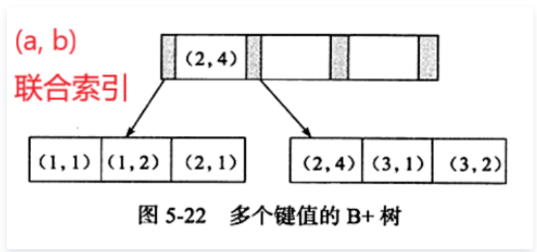
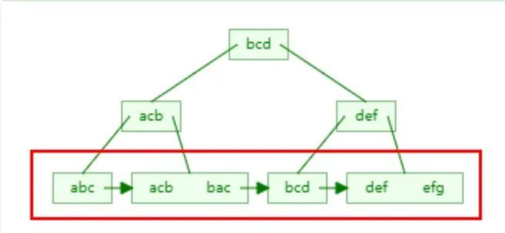

### 1、在学校的学生表中按照班级和成绩排序，降序
order by class_id asc, score desc
使用order by进行排序，asc为升序， desc为降序
### 2、如何解决redis的key和value过大的问题
将key进行拆分，或者使用pipline操作，这样可以分多次进行
### 3、如何解决数据一致性问题
方法一：

### 4、如果添加mysql的索引或者修改表
在线修改表结构的时候，如果出现数据量很大的时候。因为传统的操作会使用表锁，会导致严重的阻塞。
因此是不能直接进行修改的，需要考虑不能影响线上的业务
#### 方法一、临时表方法
1. 创建一张临时表，复制旧表的结构
2. 给新表添加字段
3. 把旧表的数据复制到新表，这个时候要不断的缩小旧表和新表之间的数据差异，在必要的时候是需要进行停机操作的
4. 删除旧表，重命名新表的名字

#### 方法二、使用pt-online-schema-change
和方法一不同的地方是在原表上加三个触发器，DELETE/UPDATE/INSERT，将原表中要执行的语句也在新表中执行
好处：
- 降低主从时延的风险
- 可以限速、限资源，避免操作的时mysql负载过高
建议在业务低峰的时候操作，降低影响


### 5、软中断

### 6、redis数据结构的实现
#### 6.1 string的实现
redis中的string使用一个叫做sds的结构实现的

### 7、进程间的通信
进程间有7种通信方式
1. 管道/匿名管道
	- 是半双工的，数据只能向一个方向流动；需要双方通信时，需要建立起两个管道
	- 只能在拥有亲缘关系的进程之间通信
	- 单独构成一种独立的文件系统；管道对于两端的进程而言，就是一个文件，单独构成一种文件系统，并且只存在于内存中
	- 数据的读写，一端进行写入，另一端进行读，写入在管道的尾部，读在管道头部

2. 有名管道
3. 信号
4. 消息队列
5. 共享内存
6. 信号量
7. 套接字

### 8、线程之间的通信
1. 锁机制
2. 信号量机制
3. 信号机制

### 9、mysql的mvcc


### 10、redis的过期是如何实现的
redis的过期是通过定期删除和惰性策略来实现的，定期删除实现的是集中处理，惰性是零散处理
定期删除：redis中将设置了过期时间的key放在一个独立的字典中，然后定时遍历这个字典来删除到期的key
惰性策略：在访问这个key的时候会去检查key的过期时间，如果过期就会立即删除

定期删除的策略：(采用一种简单的贪心策略，默认是一秒10次)
- 从过期字典中随机选出20个key
- 删除20个key中过期的key
- 如果过期的key的比例超过了1/4,就重复第一步
为了防止线程卡死的现象，算法增加了扫描时间的上限，默认不超过25ms


### 11、如何解决缓存击穿问题
是指都一个热点key，在过期的瞬间有大量请求打到了数据库上，导致的问题
设置热点key不过期，或者使用串行化

### 12、缓存穿透
当数据库和redis都没有数据的时候就会出现缓存穿透，严重的时候会击垮数据库
在接口层进行校验，对于不合法的数据直接返回，校验id，用户鉴权校验，参数校验
将数据库和redis中都没有找的对这个key在redis中设置为null，并设置一个很短的过期时间
使用redis的布隆过滤器

### 13、缓存雪崩
当缓存集中失效的时候会出现雪崩，这是请求会直接打到mysql上
1. 在给缓存里面设置过期时间的时候都加一个随机时间防止缓存全部失效
2. 如果是redis的集群将热点数据分开
3. 热点数据不过期，并且在更新的时候将缓存的数据也更改

### 14、数据库中的页

### 15、索引失效
在mysql的使用会出现索引失效的情况

#### 索引失效的原理
我们都知道索引是根据B+树进行组织的，索引在使用的时候是根据二分查找进行查找的
给表的a和b字段添加联合索引，和单值索引不同的是，联合索引的键值对不是1个，而是大于1个


a,b排序分析
a顺序：1，1，2，2，3，3
b顺序：1，2，1，4，1，2
可以看到a是有序的，b是无序的，但是当a相等的时候b也是有序的
这是在第一个字段有序后保证后面的字段有序
最佳左前缀原理
```sql
select * from testTable where a=1 and b=2
```
由于a是有序的，这时候二分查找可以找到a，b是相对有序的可以找到b
```sql
select * from testTable where b=2
```
由于a不确定，索引b也是不确定的，在B+树上无法使用二分查找找到b

范围查询右边失效的原理
```sql
select * from testTable where a>1 and b=2
```
a在B+树上是有序的，但是这时候使用了范围查找，a的值是不确定的，这时候导致b也是无序的，因此b用不到索引

like索引失效的原理
```sql
where name like "a%"  //如：abc，abd
where name like "%a%" //如：bac，dab
where name like "%a"  //如：bca，
```


可以看到在使用a%的时候a是可以通过二分查找的，其他两种类型都是不可以的

[学习](https://cloud.tencent.com/developer/article/1704743)


### 16、数据库的设计范式
通用的三大设计范式
#### 第一范式
第一范式：对属性的原子性，要求属性具有原子性，不可再分割
如学生表的(学号，性别，姓名，出生年月日)，如果认为最后一列可以在分割(出生年，出生月，出生日)，这就不是第一范式了，否则就是

#### 第二范式
第二范式：对记录的唯一性，要求记录有唯一标识，即实体的唯一性，即不存在部分依赖
如表：学号，课程号，姓名，学分
这个表中说明了两件事情：学生信息，课程信息；存在依赖关系，非主键字段必须依赖主键，学分依赖课程号，姓名依赖学号，所以不符合第二范式
可能出现的问题：

- 数据冗余：每条记录都含有相同的信息
- 删除冗余：删除所有学生成绩，就把课程信息删掉了
- 插入异常：学生未选课，无法记录进数据库
- 更新异常：调整课程学分，所有行都调整

正确做法：
学生信息表: 学号，姓名
课程表：课程号，学分
选课表：学号，课程号，成绩

#### 第三范式
第三范式是对字段的冗余性，要求任何字段不能由其他字段派生出来，它要求字段没有冗余，即不存在传递依赖
表： 学号，姓名，年龄，学院名称，学院电话
依赖传递：学号--->学生--->学院--->学院电话
可能存在的问题：

- 数据冗余：有重复值
- 更新异常：有重复冗余数据，修改时需要更新多条数据，否则会出现数据不一致的情况


上面的表要是更新电话需要该学院所有的学生信息都更新。
正确的做法：
学生： 学号，姓名，年龄，学院名称
学院: 学院，电话

不过在实际的使用中会有一些反范式化的操作，为了更快的查询
比如订单表中会保存单价，数量和总价，这个总价是可以通过单价和数量计算出来的，因此这样就不符合第三范式了。但是这样可以提高查询的性能

范式化的优点：

- 尽可能的减少数据冗余（数据表更新快体积小）
- 范式化更新操作比反范式化更快
- 通常比反范式化的表小

缺点：

- 查询时需要多个表进行关联，导致性能下降
- 更难进行索引优化

反范式化的优点：

- 减少表的关联
- 更好的进行索引优化

缺点：

- 存在数据冗余和数据维护异常
- 对数据的修改需要更多的成本

[通俗易懂的](https://segmentfault.com/a/1190000013695030)


### 17、kafka的使用

### 18、zk的使用

### 19、TIME_WAIT和CLOSE_WAIT


