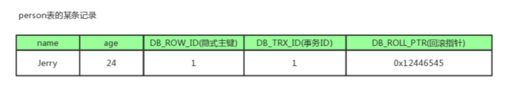

### 1、在学校的学生表中按照班级和成绩排序，降序
order by class_id asc, score desc
使用order by进行排序，asc为升序， desc为降序
### 2、如何解决redis的key和value过大的问题
将key进行拆分，或者使用pipline操作，这样可以分多次进行
### 3、如何解决数据一致性问题
方法一：

### 4、如果添加mysql的索引或者修改表
在线修改表结构的时候，如果出现数据量很大的时候。因为传统的操作会使用表锁，会导致严重的阻塞。
因此是不能直接进行修改的，需要考虑不能影响线上的业务
#### 方法一、临时表方法
1. 创建一张临时表，复制旧表的结构
2. 给新表添加字段
3. 把旧表的数据复制到新表，这个时候要不断的缩小旧表和新表之间的数据差异，在必要的时候是需要进行停机操作的
4. 删除旧表，重命名新表的名字

#### 方法二、使用pt-online-schema-change
和方法一不同的地方是在原表上加三个触发器，DELETE/UPDATE/INSERT，将原表中要执行的语句也在新表中执行
好处：
- 降低主从时延的风险
- 可以限速、限资源，避免操作的时mysql负载过高
建议在业务低峰的时候操作，降低影响


### 5、中断
中断分为两种类型，硬中断和软中断
#### 5.1 硬中断
顾名思义就是由硬件产生的中断，如磁盘，网卡，时钟。每个设备或设备集都有它自己的IRQ(中断请求)，基于IRQ，CPU可以将相应的请求分发到对应的硬件驱动上(硬件驱动通常是内核的子程序而不是独立的进程)
处理中断的驱动需要运行在CPU上，因此当中断产生的时候CPU会中断当前运行的任务来处理中断(多核的通常只能中断一颗CPU)
硬中断可以直接中断CPU，如果一个中断处理的时间较长的话也会被其他硬中断中断
时钟中断，内核调度代码会将当前正在运行的进程挂起

#### 5.2 软中断
由正在运行的进程所产生的
一般是由一些IO请求，这些请求会调用内核中可以调度IO发生的程序
软中断仅与内核相联系，软中断并不会直接中断CPU，通常是正在运行的进程需要内核做一些事情的

[软硬中断的区别](https://blog.51cto.com/noican/1361087)

### 6、redis数据结构的实现
redis中使用ziplist的上限值都是可以被修改的，

#### 6.1 string的实现
redis中的string使用一个叫做sds(简单动态字符串)的结构实现的
```c
struct sdshdr{
	int len;//表示buf中已经占用的空间，即当前string的长度
	int free; //buf中剩余的可用长度
	char buf[]; //数据空间
};
```
在buf中的最后一个字节保存的是'\0'表示空字符，这个字符是不会被记入到len中的
实际的使用中buf的实际长度会是len的一倍，这样的好处在于减少字符串在修改时候的内存重新分配次数(len的值小于1MB分配的是len的一倍，大于1MB的则多分配1MB)
惰性空间释放，当string缩短的时候，SDS不会立即释放空间的，而是会将那些字节数使用free记录起来，等待将来使用
由于SDS使用的是len来判断字符串是否结束的，所以可以保存任意字符，是二进制安全的

#### 6.2 zset的实现方式
redis中的zset有两种实现方式：

- ziplist：压缩链表
	- 元素少于128时
	- 每个元素长度小于64字节
- skiplist：跳跃链表，不满足上面条件的就是使用跳跃表的具体使用的map和skiplist
	- map用来存储member到score的映射，这样可以在O(1)的时间找到member对应的分数
	- skiplist按从小到大来顺序存储分数
	- skiplist每个元素的值都是(score, value)对

skipset在使用的过程中是有最大层级的其中redis中的设定为23级
一个元素拥有第一层的连接概率是100%
一个元素拥有第二层的连接概率是50%
一个元素拥有第三层的连接概率是25%

插入过程是先在map中找value是否存在，存在则在skiplist中先删除在插入，否则直接删除在插入和删除的时候都会更新元素中的Next指针

#### 6.3 set的实现
set是redis中的无序的集合，底层的存储结构使用的是intset和hashtable两种数据结构存储
intset可以理解为数组，hashtable就是普通的hash表
使用intset必须满足下面的条件：

- 集合对象保存的所有元素都是整数值
- 集合对象保存的元素数量不超过512个

intset数据结构，在存储的时候是有序的，查找数据的时候是通过二分查找来实现的
```c
struct intset{
	uint32 encoding;
	uint32 length;
	int8 contents[];
}
```
当length超过512的时候会转为hashtable

set在使用sadd的过程：

- 检查set是否存在，不存在则创建
- 根据传入的set集合一个个进行添加，添加的时候需要进行内存压缩
- 在执行的过程中会检查是否进行编码转化

#### 6.4 list的实现
redis中的list有两种实现方式：

- 压缩链表
- 双端链表

redis中默认使用的是ziplist，当满足下面的条件的时候就会转为双向链表

- 向列表中添加的值长度超过64
- ziplist的节点数超过512

在3.2版本后使用的是quicklist，这个是将一个个小的ziplist连接起来，一个双向的ziplist的链表

#### 6.5 hash的实现
redis的hash有两种实现方式，ziplist和hashtable
使用的ziplist的条件：

- 在键值长度小于64
- 键值对数量小于512个

其他情况使用的都是hashtable
hashtable使用的是链地址发解决冲突，哈希表节点使用单链表结构，rehash优化
rehash：
当键值对太多或者太少的时候hash表都会进行调整
在dict结构中有两个dictht，ht[0]保存的是实际的数据，ht[1]是用于rehash的
[代码](https://github.com/Alvin-Fu/studyredis/blob/master/redis/src/struct/dict.h)

1. 在rehash的时候首先会给ht[1]根据ht[0]分配内存
2. 将ht[0]中的数据rehash(重新计算hash值)到ht[1]中
3. ht[0]中的数据都转移到了ht[1]上后将ht[0]删掉，将ht[1]设置为ht[0]并将ht[1]初始化，为下一次rehash准备

渐进式rehash，由于大量数据迁移会导致CPU繁忙，导致一段时间停止服务，渐进式rehash的步骤：

1. 同时维持两个哈希表(ht[0],ht[1])
2. 维持一个计数器，初始值为0
3. 每次增删操作会顺带将ht[0]中的数据迁移到ht[1]中，并且计数器加一，ht[0]中的数据只增不减
4. 知道rehash完成，计数器的值设为-1
5. 在查询的时候会在两个表中都查找会先判断计数器的值是否大于0

### 7、进程间的通信
进程间有7种通信方式
1. 管道/匿名管道
	- 是半双工的，数据只能向一个方向流动；需要双方通信时，需要建立起两个管道
	- 只能在拥有亲缘关系的进程之间通信
	- 单独构成一种独立的文件系统；管道对于两端的进程而言，就是一个文件，单独构成一种文件系统，并且只存在于内存中
	- 数据的读写，一端进行写入，另一端进行读，写入在管道的尾部，读在管道头部

2. 有名管道
3. 信号
4. 消息队列
5. 共享内存
6. 信号量
7. 套接字

### 8、线程之间的通信
1. 锁机制
2. 信号量机制
3. 信号机制

### 9、mysql的mvcc
数据库中的mvcc是为了解决高并发的问题，以前的版本中只有读读是高并发的，读写，写读，写写都要阻塞。
引入mvcc以后只有写写之间是相互阻塞的，其他三种是可以并行的，这个大幅提高量InnoDB的并发能力。
InnoDB是在undolog中实现的(Postgres是在数据行实现多版本的)，**通过undolog可以找回历史版本**。根据隔离级别提供给用户读(读不同的历史版本)，也可以在回滚的时候覆盖数据页上的数据。
在InnoDB内部，会记录一个全局的活跃读写事务数组，主要是用来判断事务的可见性，根据事务id的大小来判断
[mysql事务详解](../database/mysql/mysql的事务和锁.md)

**当前读：** (悲观锁的实现)就是读取当前最新版本，读取的时候还需要保证其他事务不能修改当前记录，需要对读取的数据进行加锁
**快照读：** (乐观锁的实现)即不加锁的非阻塞读；快照读的前提是隔离级别不是串行化，串行化下的快照读就会退化成当前读。快照读是基于提高并发性能的考虑，实际是基于MVCC实现的，(MVCC是行锁的一个变种)，在大部分情况下可以避免加锁降低开销。基于多版本的快照读可能读到的并不一定是数据的最新版本，而有可能是之前的历史版本

#### 9.1 当前读，快照读和MVCC的关系

- MVCC多版本控制，就是维持一个数据的多个版本，使得读写操作没有冲突，是理想模型
- 快照读就是MVCC理想模型中非阻塞读功能的具体实现。相对而言当前读就是悲观锁的具体功能的实现
- MVCC模型在MySQL中的实现是由三个隐式字段，undo日志，Read View等完成的

#### 9.2 MVCC解决的问题和好处
mysql并发面临的问题

- 并发读没有问题
- 并发读写，会出现脏读，不可重复读，幻读等
- 并发写，有线程安全问题，可能会存在更新丢失问题，第一类更新丢失，第二类更新丢失

**注：**

- 第一类更新：事务A会滚时会将事务B的更新覆盖
- 第二类更新：事务A覆盖事务B已经提交的数据，造成事务B所做的操作丢失

MVCC的好处
MVCC(多版本并发控制)是一种用来解决读写冲突的无锁并发控制，为事务分配单向增长的时间戳，为每一个修改保存一个版本并将版本和时间戳关联，读操作只读事务开始之前的数据库快照
解决的问题：

- 并发读写的时候，读写之间不用阻塞，提高了数据的并发读写的性能
- 同时解决了脏读，不可重复读等事务隔离问题，不能解决更新丢失问题

为了解决数据库的读写和写写的并发性能问题会采用以下两种方式：

- MVCC+悲观锁 MVCC解决读写，悲观锁解决写写
- MVCC+乐观锁 MVCC解决读写，乐观锁解决写写

#### 9.3 MVCC的实现
mvcc是利用3个隐式字段，undo日志，Read View来实现
**隐式字段：**

- DB_TRX_ID: 6byte，事务id(写操作)
- DB_ROLL_PTR: 7byte,会滚指针，指向这条记录的上一个版本(存储于rollback segment中)
- DB_ROW_ID: 6byte, 隐藏的自增ID，如果数据表没有主键，InnoDB会自动以DB_ROW_ID产生一个聚簇索引
- 实际上还有一个隐藏的flag隐藏字段，记录更新或者删除并不代表真正的删除，而是删除flag变了



DB_ROLL_PTR回滚指针会配合undo log使用指向上一个旧版本

**undo log**
undo log分为两种

- insert undo log：表示事务在insert新纪录的时候产生undo log，只在事务回滚时需要，并且在事务提交后被丢弃
- update undo log: 表示事务在update或在delete时产生，不仅在回滚时需要，在快照读也需要，不能随便删除，只有在快速读或事务回滚不涉及该日志时，对应的日志才会被purge线程统一清除

purge线程：
我们可以看到update和delete的时候不会真的将数据删掉，而是通过purge线程进行操作的，purge线程会清理deleted_bit为true的记录，purge也会维护一个read view(相当于系统中最老活跃事务的read view)，如果deleted_bit为true并且DB_TRX_ID相对于read view可见这条记录就会被安全清除

undo log实际上就是一个链表(即线性版本链)，事务id大的就在前面放着，小的在后面，主要是更新和删除的记录，因为写的记录在事务提交以后就被删除了

**Read View(读视图)**
本质就是事务进行快照读操作的时产生的读视图，在该事务执行的快照读的那一刻，会生成数据库系统当前的一个快照，记录并维护系统当前活跃事务的ID
然后将当前的事务ID和系统中其他活跃事务的ID进行对比，看是否满足可见性，如果不满足就通过DB_ROLL_PTR回滚指针取出Undo Log中的事务ID在比较，从链表的头向尾遍历直到找到满足条件的事务ID，这个条老记录就是当前事务可见的最新老版本

RC和RR下的快照读的不同：

- RC下的每一次快照读都会生成新的快照和read view，可以看到后面的提交
- RR下的快照读只会在第一次生成快照和read view，不能看到后面的提交

[mvcc详解](https://www.cnblogs.com/xuwc/p/13873611.html)


### 10、redis的过期是如何实现的
redis的过期是通过定期删除和惰性策略来实现的，定期删除实现的是集中处理，惰性是零散处理
定期删除：redis中将设置了过期时间的key放在一个独立的字典中，然后定时遍历这个字典来删除到期的key
惰性策略：在访问这个key的时候会去检查key的过期时间，如果过期就会立即删除

定期删除的策略：(采用一种简单的贪心策略，默认是一秒10次)
- 从过期字典中随机选出20个key
- 删除20个key中过期的key
- 如果过期的key的比例超过了1/4,就重复第一步
为了防止线程卡死的现象，算法增加了扫描时间的上限，默认不超过25ms


### 11、如何解决缓存击穿问题
是指都一个热点key，在过期的瞬间有大量请求打到了数据库上，导致的问题
设置热点key不过期，或者使用串行化

### 12、缓存穿透
当数据库和redis都没有数据的时候就会出现缓存穿透，严重的时候会击垮数据库
在接口层进行校验，对于不合法的数据直接返回，校验id，用户鉴权校验，参数校验
将数据库和redis中都没有找的对这个key在redis中设置为null，并设置一个很短的过期时间
使用redis的布隆过滤器

### 13、缓存雪崩
当缓存集中失效的时候会出现雪崩，这是请求会直接打到mysql上
1. 在给缓存里面设置过期时间的时候都加一个随机时间防止缓存全部失效
2. 如果是redis的集群将热点数据分开
3. 热点数据不过期，并且在更新的时候将缓存的数据也更改

### 14、数据库中的页

### 15、索引失效
在mysql的使用会出现索引失效的情况

#### 索引失效的原理
我们都知道索引是根据B+树进行组织的，索引在使用的时候是根据二分查找进行查找的
给表的a和b字段添加联合索引，和单值索引不同的是，联合索引的键值对不是1个，而是大于1个


a,b排序分析
a顺序：1，1，2，2，3，3
b顺序：1，2，1，4，1，2
可以看到a是有序的，b是无序的，但是当a相等的时候b也是有序的
这是在第一个字段有序后保证后面的字段有序
最佳左前缀原理
```sql
select * from testTable where a=1 and b=2
```
由于a是有序的，这时候二分查找可以找到a，b是相对有序的可以找到b
```sql
select * from testTable where b=2
```
由于a不确定，索引b也是不确定的，在B+树上无法使用二分查找找到b

范围查询右边失效的原理
```sql
select * from testTable where a>1 and b=2
```
a在B+树上是有序的，但是这时候使用了范围查找，a的值是不确定的，这时候导致b也是无序的，因此b用不到索引

like索引失效的原理
```sql
where name like "a%"  //如：abc，abd
where name like "%a%" //如：bac，dab
where name like "%a"  //如：bca，
```


可以看到在使用a%的时候a是可以通过二分查找的，其他两种类型都是不可以的

[学习](https://cloud.tencent.com/developer/article/1704743)


### 16、数据库的设计范式
通用的三大设计范式
#### 第一范式
第一范式：对属性的原子性，要求属性具有原子性，不可再分割
如学生表的(学号，性别，姓名，出生年月日)，如果认为最后一列可以在分割(出生年，出生月，出生日)，这就不是第一范式了，否则就是

#### 第二范式
第二范式：对记录的唯一性，要求记录有唯一标识，即实体的唯一性，即不存在部分依赖
如表：学号，课程号，姓名，学分
这个表中说明了两件事情：学生信息，课程信息；存在依赖关系，非主键字段必须依赖主键，学分依赖课程号，姓名依赖学号，所以不符合第二范式
可能出现的问题：

- 数据冗余：每条记录都含有相同的信息
- 删除冗余：删除所有学生成绩，就把课程信息删掉了
- 插入异常：学生未选课，无法记录进数据库
- 更新异常：调整课程学分，所有行都调整

正确做法：
学生信息表: 学号，姓名
课程表：课程号，学分
选课表：学号，课程号，成绩

#### 第三范式
第三范式是对字段的冗余性，要求任何字段不能由其他字段派生出来，它要求字段没有冗余，即不存在传递依赖
表： 学号，姓名，年龄，学院名称，学院电话
依赖传递：学号--->学生--->学院--->学院电话
可能存在的问题：

- 数据冗余：有重复值
- 更新异常：有重复冗余数据，修改时需要更新多条数据，否则会出现数据不一致的情况


上面的表要是更新电话需要该学院所有的学生信息都更新。
正确的做法：
学生： 学号，姓名，年龄，学院名称
学院: 学院，电话

不过在实际的使用中会有一些反范式化的操作，为了更快的查询
比如订单表中会保存单价，数量和总价，这个总价是可以通过单价和数量计算出来的，因此这样就不符合第三范式了。但是这样可以提高查询的性能

范式化的优点：

- 尽可能的减少数据冗余（数据表更新快体积小）
- 范式化更新操作比反范式化更快
- 通常比反范式化的表小

缺点：

- 查询时需要多个表进行关联，导致性能下降
- 更难进行索引优化

反范式化的优点：

- 减少表的关联
- 更好的进行索引优化

缺点：

- 存在数据冗余和数据维护异常
- 对数据的修改需要更多的成本

[通俗易懂的](https://segmentfault.com/a/1190000013695030)


### 17、kafka的使用

### 18、zk的使用

### 19、TIME_WAIT和CLOSE_WAIT
time_wait是主动关闭一方进入的状态，可以通过修改系统参数进行解决
close_wait是被动一方进入的状态，不能通过修改系统参数进行解决，而是需要通过排查业务代码，一般都是业务代码出现问题了
close_wait产生的原因在于被动关闭的一方在收到了对方的关闭请求后没有恢复ack信息，即在对方关闭以后程序没有检测到或者忘记了要关闭连接，于是这个资源会被一直占用，系统不会主动回收正在使用的资源。


