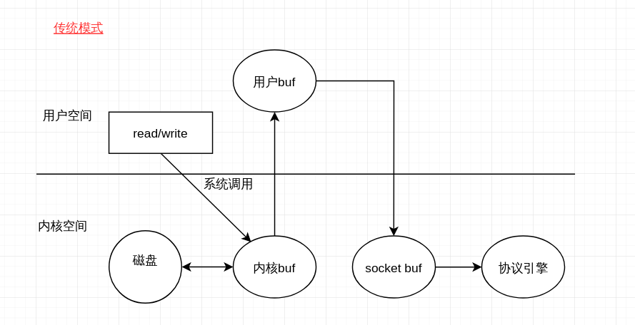
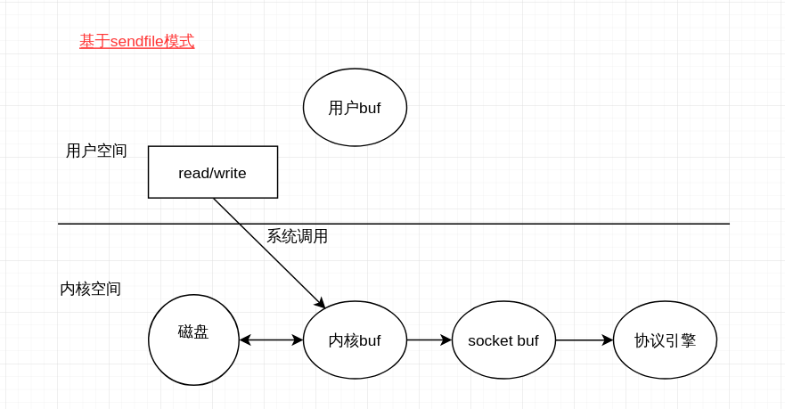

# 为什么这么快
kafka为什么这么快，一般认为在磁盘上写或在读数据性能很低的，但是kafka将消息缓存在磁盘中还是高吞吐量的。
对写入和读取两方面进行分析。
在大多数情况下性能的瓶颈都是在网络io中而不是在cpu或者磁盘中，因此需要的尽量少的消耗网络io的资源对数据进行适度的压缩
## 写入数据
kafka中通过两点保证写性能顺序写和MMFile
### 顺序写入
磁盘读写的快慢取绝于你怎么使用它，即顺序读写或随机读写。磁盘的顺序读写速度和内存持平。
kafka就是使用了顺序I/O，如果使用内存时存在的问题，java对象的内存开销很大并且随着堆内存数据的增多，java的GC时间变得很长。
使用磁盘操作的好处：

- 顺序写入磁盘的速度超过了内存随机读写
- 顺序写入JVM的GC效率低，内存占比大(磁盘可以避免)
- 顺序写入系统冷启动后，磁盘缓存依然可用

kafka在写入数据由于是顺序写入，每一个Partition都是一个文件，收到消息后kafka会将数据插入到文件末尾
这种的缺点就是无法删除数据，kafka也不会删除数据，每一个消费者对每个topic都有一个offset用来表示读取到第几条数据

kafka有两种策略删除数据

	1. 顺序写入基于时间
	2. 顺序写入基于partition文件大小
具体可以通过配置进行配置

### Memory Mapped Files
即便是顺序写入硬盘也不能追上内存，因此kafka的数据并不是实时的写入硬盘，充分利用了现代操作系统分页存储来利用内存提高IO效率
Memory Mapped Files(简称mmap)即内存映射，在64位操作系统中一般可以表示20G的数据文件，原理就是直接利用操作系统的page来实现文件到物理内存的直接映射
操作系统会在适当的时候将内存的数据同步到硬盘中，通过mmap使得io提升很大，当然这时虚拟内存，明显的缺陷是不可靠，kafka提供一个参数producer.type来控制是不是主动flush，如果写到mmap后就调用flush就是同步，写入后立即返回给生产者不调用就是异步

 

## 读取数据
### 基于sendfile实现的zero copy
zero copy和传统的对比图

可以看到比传统的少了一次从内核区到用户取的copy，最大程度的减少了开销
### 压缩
kafka内置了多种压缩算法对消息进行批量压缩，多个消息一起压缩

# 参考
[kafka为什么这么快](https://cloud.tencent.com/developer/article/1448153)