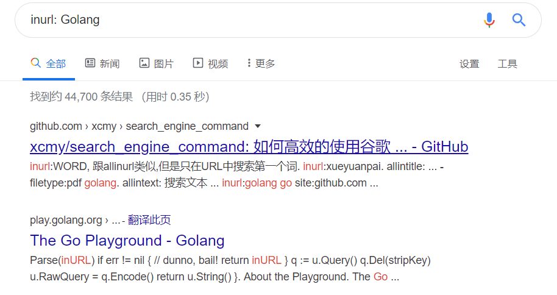

# 如何使用google或百度等搜索引擎提高搜索效率
无论在工作还是在平时的生活中，离不开搜索引擎，正如内事问百度，外事用谷歌一样，高效的搜索可以成倍的提高效率，到达事半功倍的效果。
在平时的搜索的时候我们可以看到第一页基本都是广告，当然使用简单的工具就可以将其过滤掉
## 搜索引擎命令
### 1、|用于过滤
如： golang课程 | 广告 推广 可以有效的过滤掉广告，特别是在某度上
注意|的左右两边需要有空格

### 2、双引号("")
"领域驱动设计" 表示完全匹配，顺序与内容完全一样

### 3、减号(-)
表示不包含减号后面的内容   搜索 -引擎 注意减号左边有空格，右边没有

### 4、星号(*)
*表示任意字符

### 5、inurl
inurl表示在关键字出现在url页面中
inurl: Golang

### 6、inanchor

### 7、intitle
返回页面的title中包含关键字的页面 

### 8、allintitle
可以使用多个关键词 
allintitle: 区块链 技术

### 9、allinurl
和5的效果一样，可以使用多个关键字
allinurl: 云  游戏 发展 现状

### 10、filetype
指定文件类型去搜索文件
filetype: pdf 领域驱动设计

### 11、site
用于搜索某个域名下的所有文件

### 12、related

