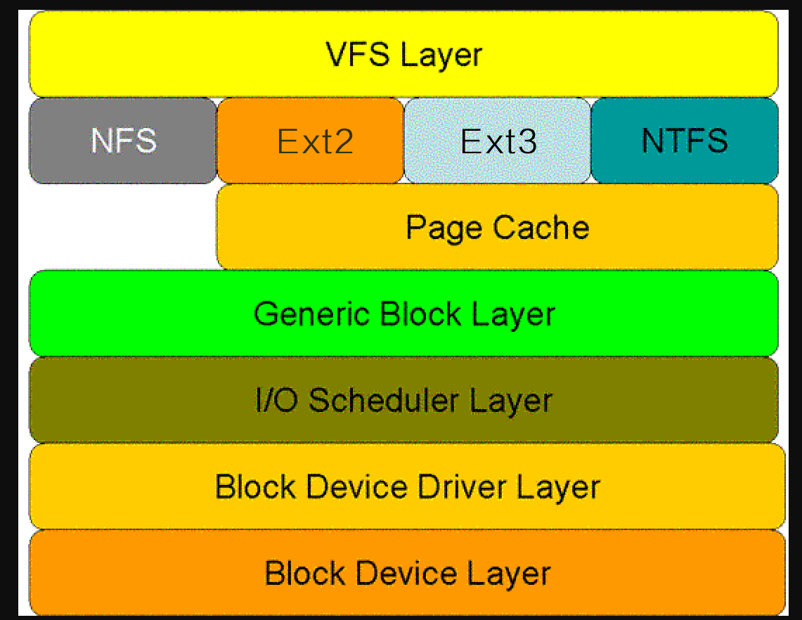

阅读文章：[磁盘I/O那些事](https://tech.meituan.com/2017/05/19/about-desk-io.html)
衡量磁盘的重要指标IOPS和吞吐量
### IOPS
IOPS(Input/Output Per Second)即每秒的输入输出量(即读写次数)，系统中每秒可以处理的I/O请求的数量
那些情况下关注IOPS：随机读写频繁的应用，如：小文件的存储等
### 吞吐量
吞吐量(Throughput)，指的是单位时间可以成功传输的数据数量
那些情况下会关注：顺序读写频繁的应用，视频点播，即关注连续读写的能力
吞吐量主要取决于磁盘阵列的架构，通道的大小和磁盘的个数

操作系统操作硬盘的模型图
通常情况下15000rpm磁盘计算出来的理论最大的IOPS为166，在实际的使用中会超过这个限制因为操作系统会进行调优，不是所有的磁盘操作都是直接到物理设备层的，还有一些缓存等
	- 虚拟文件系统层(VFS Layer)
	- 具体的文件系统层(Ext2等)
	- Cache层(Page Cache Later)
	- 通用块层(Generic Block Layer)
	- I/O调度层(I/O Scheduler Layer)
	- 块设备驱动层(Block Device Driver Layer)
	- 物理块设备层(Block Device Layer)

### 虚拟文件系统层
VFS(Virtual File System)，虚拟文件系统是系统中的文件管理员(一种软件机制)。 主要的作用就是屏蔽对具体文件系统操作的差异，提供统一的接口(个人认为：和适配器一样，对下层可能有多种不同的体系，对于上层只需要调用接口就好了，不需要理解下层具体做了什么，怎么做的)
VFS中包含一系列的数据结构用于向物理文件系统的转换，主要包含：
	- 超级块(Super Block):表示一个文件
	- 索引节点(Inode):
	- 目录项(Dentry):
	- 文件对象(File):

### Ext2文件系统层

### Cache层

### 通用块层
