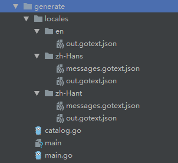

## 多语言
使用generate和gotext实现多语言
首先在代码中需要添加generate的命令
```
// NOTE: change -lang option to add more languages support.
//go:generate gotext -srclang=en update -out=catalog.go -lang=en,zh-hans,zh-hant

gotext用于管理源码中的文本
	update用于更新翻译和generate输出的catalog文件，

-out是指定输出的.go文件的位置， -lang是指定语言的类型

```
只会生成代码中有的标签，需要有message.gotext.json这是放的翻译的内容
