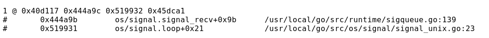
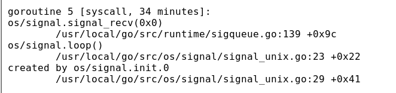

**在使用pprof过程中的总结，排查内存泄露,内存泄露的主要原因就是goroutine没有退出，因此主要是要排查goroutine是否正常退出**
**注意:** 在golang中使用goroutine的时候一定要

### pprof的使用

#### goroutine的使用
`http://127.0.0.1:8080/debug/pprof/goroutine?debug=1` 在web界面使用debug=1和debug=2是会有不同的

图1是debug=1的情况，前面的1表示当前有多少个goroutine在运行这个调用栈
图2是debug=2的情况，数字表示goroutine的id，[]里面的表示是怎么阻塞的，和等待的时间，同时也可以看到当前停在了哪一行

#### heap的使用
**生成正在使用的内存**
`go tool pprof -inuse_space http://127.0.0.1:8080/debug/pprof/heap` 获取的是当前还在使用的内存
`go-torch -inuse_space http://127.0.0.1:8080/debug/pprof/heap --colors=mem` 生成火焰图
**生成分配的内存相关的**
`go tool pprof -alloc_space http://127.0.0.1:8080/debug/pprof/heap` 获取的是当前还在使用的内存
`go-torch -alloc_space http://127.0.0.1:8080/debug/pprof/heap --colors=mem` 生成火焰图

